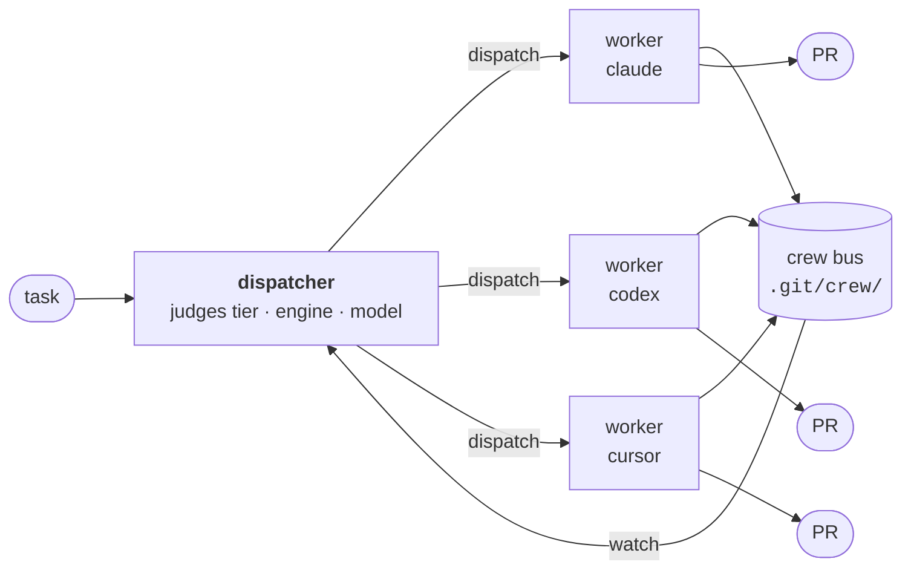

# dispatcher

**Run a crew of coding agents like a team, not a thread.**

[](https://github.com/noamsto/dispatcher/actions/workflows/ci.yml)
&nbsp;
&nbsp;
&nbsp;

`dispatcher` turns one agent session into an orchestrator. It judges each task
into a tier, an engine and a model, scaffolds one worker per task in its own git
worktree and tmux window, and coordinates the whole crew over a git-backed
message bus. Workers survive the session that spawned them. The orchestrator
never writes code.

It runs on **Claude Code**, **OpenAI Codex** and **Cursor** — and can mix them in
a single crew, so a refactor goes to one model while the security-sensitive
change goes to another.

---

## Why this exists

Subagents live and die inside one conversation. That is fine for a fan-out you
watch, and wrong for work that takes an hour.

A dispatched worker here is a **real process** in its own worktree. It outlives
its parent, reports progress to a bus you can query from any shell, opens its own
PR, and can be recovered after a crash because the bus is an append-only log in
`.git/`, not memory. Nothing is in a context window that you cannot also read
with `jq`.



Each worker gets its own worktree, its own tmux window, and a colour-coded
codename derived from its branch, so a nine-window session stays legible.

---

## How a task is judged

Two independent levers, deliberately not conflated.

**Tier** sets pipeline depth — how much review the work gets:

| Tier       | Pipeline                                                                                              |
| ---------- | ----------------------------------------------------------------------------------------------------- |
| `trivial`  | implement → gate → PR. No critics.                                                                    |
| `standard` | plan → **plan-critic** → implement → fast gate → review gate → PR                                     |
| `deep`     | spec → **spec-critic** → optional decomposition consult → plan → plan-critic → implement → gates → PR |

**Engine and model** set how strong the implementer is. "Small but risky" means
_raise the tier_, not just the model — bumping the model alone ships work that is
smarter but still unreviewed.

A third lever, `--plan provided|required`, decouples _planning_ from _reviewing_:
hand a worker a spec that already names the root cause, the files, the approach
and the acceptance criteria, and it skips re-planning without losing its review
gate.

---

## The crew bus

A coordination bus with no daemon, no socket and no server — an append-only
JSONL log under `.git/crew/`, so it is inspectable, greppable and survives
anything.

```bash
crew roster                  # who is working, on what, how long
crew status <from> <state>   # worker → dispatcher progress
crew watch --states blocked  # block until something needs you
crew inbox dispatcher:<id>   # messages addressed to you
crew reap --dry-run          # reclaim worktrees whose PRs have landed
```

Full surface: `id`, `identity`, `status`, `msg`, `reply`, `await`, `register`,
`deregister`, `watch`, `roster`, `inbox`, `stall-watch`, `log`, `report`, `rate`,
`reap`.

Two design notes worth knowing. `reap` gates on **the PR having landed**, never
on elapsed time — a worker sits in `done` for as long as review takes, and a
time-based sweep would delete live work. And `stall-watch` exists because a
wedged worker never reports anything at all: it watches pane output and posts
`failed` so the dispatcher wakes up instead of waiting forever.

---

## Engine support

The harness is engine-neutral; the adapters are not. Each engine gets what it can
actually express:

|                               | Claude Code |        Codex        |      Cursor      |
| ----------------------------- | :---------: | :-----------------: | :--------------: |
| Packaging                     |   plugin    |       plugin        |   loose files¹   |
| Slash commands                |     ✅      | ❌ ships as skills² |        ✅        |
| Skills                        |     ✅      |         ✅          |        ✅        |
| Subagents                     |     ✅      |         ❌          |       ✅³        |
| Hooks                         |     ✅      |         ✅          |        ✅        |
| Worker: critics + review gate |     ✅      |  ⚠️ process-light   | ⚠️ process-light |

¹ Cursor has no plugin format yet, so rules and commands are written directly
into `~/.cursor/`. A `.mdc` rule without `alwaysApply: true` is silently ignored.
² Codex has no custom slash commands — custom prompts are deprecated in favour of
skills — so each command ships as a skill, invoked `$autopilot` or via `/skills`.
³ Cursor has subagents, but not the model this pipeline is built on.

**Process-light is a promise, not an omission.** Codex and cursor workers run
single-agent, so they emit `plan_critic_first_pass: null`, `review_high: null`,
`review_mode: "none"` — a run is never mistaken for _reviewed and clean_.

---

## Install

Nix flake with a Home Manager module:

```nix
# flake.nix
dispatcher = {
  url = "github:noamsto/dispatcher";
  inputs.nixpkgs.follows = "nixpkgs";
};
```

```nix
# home-manager
imports = [inputs.dispatcher.homeManagerModules.default];

programs.dispatcher = {
  enable = true;
  profile = "work"; # gates the codex and cursor engines
};
```

That puts `crew`, `dispatch` and `dispatcher` on `PATH`, exports
`DISPATCH_PROFILE` and `DISPATCHER_PROTOCOL_DIR`, installs the Codex plugin and
writes the Cursor rule and commands.

For Claude Code, pass the plugin directory to `claude`:

```nix
--plugin-dir ${config.programs.dispatcher.claudePluginDir}
```

<details>
<summary><b>Prerequisites this module deliberately does not manage</b></summary>

- **Codex marketplace stanzas.** The plugin is inert until `~/.codex/config.toml`
  declares it. No store path is involved, so this stays hand-managed:

  ```toml
  [marketplaces.dispatcher]
  source_type = "local"
  source = "/path/to/dispatcher/adapters/codex"

  [plugins."dispatcher@dispatcher"]
  enabled = true
  ```

- **A Codex worker profile.** `profile = "work"` launches Codex workers with
  `--profile worker`, requiring `~/.codex/worker.config.toml`. That belongs to
  your Codex config. It is a runtime file, so there is no eval-time check — a
  missing profile surfaces as a launch failure in the worker pane.

- **Engine CLIs and auth.** `claude`, `codex`, `cursor-agent` and
  [`wt`](https://worktrunk.dev) resolve from the ambient `PATH`; log each in out
  of band.

</details>

---

## Usage

```bash
dispatcher                       # promote this shell into an orchestrator
dispatcher --agent codex         # …running on a different engine
dispatcher "fix the flaky test"  # …with a first task
```

From inside a dispatcher session:

```bash
dispatch --crew-id <id> standard sonnet --effort medium ENG-421 "fix the retry loop"
dispatch --crew-id <id> deep opus --effort high --agent codex "redesign the export pipeline"
dispatch --crew-id <id> trivial haiku --effort low --plan provided "rename the flag"
```

Four commands ship with the plugin — `/dispatcher`, `/autopilot`, `/finish-prs`,
`/project-autopilot` (namespaced `/dispatcher:*` on Claude Code and Codex).

---

## Iterating on the protocols

The protocols are the product. `dispatch` resolves them as
`${DISPATCHER_PROTOCOL_DIR:-<baked store path>}`, so:

```bash
export DISPATCHER_PROTOCOL_DIR=~/src/dispatcher/adapters/core/protocols
```

Edit a protocol, dispatch again, and the change is live — no rebuild. The same
variable is what the slash command and the Cursor rule resolve at read time,
which is why the module exports it rather than only baking it into the binaries.

---

## Development

```bash
direnv allow          # or: nix develop
bats tests/           # 70 tests
nix flake check       # formatting + pre-commit
./scripts/gen-adapters.sh   # regenerate adapters after editing a command body
```

CI runs shellcheck, the bats suite, `nix flake check`, and a **drift gate** that
regenerates every adapter and fails if committed output differs.

`nix flake check` reports `homeManagerModules` as _unchecked_ — it never
evaluates the module. `tests/module.bats` closes that gap by forcing the config
body, not just the options.

`tests/live/` holds checks needing a real tmux server; run those by hand.

<details>
<summary><b>Why <code>adapters/</code> is excluded from formatters</b></summary>

Nothing under `adapters/` is hand-authored here — it is vendored payload or
generator output. Two reasons it must not be reformatted:

1. **It is content, not style.** These files are fed to models as system prompts
   and instructions. Prettier rewrote nested code fences inside a teammate prompt
   template, restructuring it.
2. **It would deadlock the drift gate.** CI regenerates the adapters and asserts
   no diff; reformatting generated output after the generator writes it means
   committed output can never match a fresh run.

</details>

---

## Layout

```
adapters/
├── core/                    engine-neutral
│   ├── crew.sh              833 L · the bus
│   ├── dispatch.sh          309 L · worker scaffolder
│   ├── dispatcher.sh        146 L · orchestrator launcher
│   ├── protocols/           DISPATCHER · WORKER · orchestration
│   └── commands/            shared bodies, projected per engine
├── claude-code/plugin/      commands · agents · skills · workflows · hooks
├── codex/plugin/            skills · hooks   (no agents/workflows: unsupported)
└── cursor/                  rules · commands (no plugin format)
scripts/gen-adapters.sh      projects core/commands into all three shapes
nix/hm-module.nix            Home Manager module
```

---

## Status and roadmap

Extracted from a personal NixOS monorepo, where it ran daily for months. The
shell moved verbatim so the extraction is provably behaviour-preserving.

Next up:

- **Crew-bus fan-out for `finish-prs` and `project-autopilot`.** Both currently
  spawn Claude Code teammates, making them claude-only. The crew bus is already
  the engine-neutral equivalent — porting them makes them work everywhere and
  collapses a duplicate fan-out architecture.
- **Closing the process-light gap** so Codex and Cursor workers get a critic
  pipeline and a review gate.

## License

MIT
