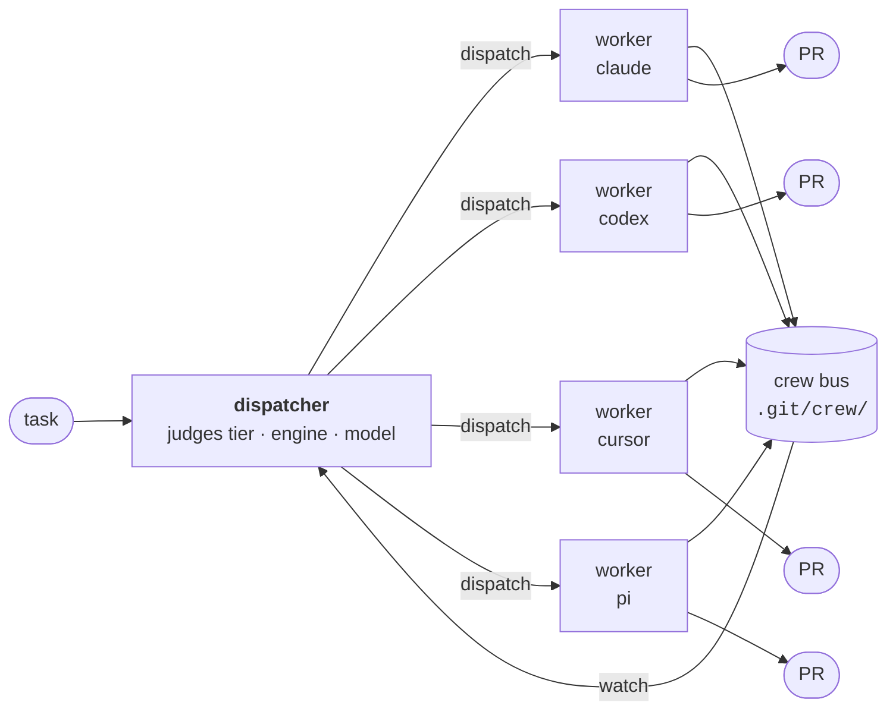

# dispatcher

**Run a crew of coding agents like a team, not a thread.**

[](https://github.com/noamsto/dispatcher/actions/workflows/ci.yml)
&nbsp;
&nbsp;
&nbsp;

`dispatcher` turns one agent session into an orchestrator. It judges each task
into a tier, an engine and a model, scaffolds one worker per task in its own git
worktree and tmux window, and coordinates the whole crew over a git-backed
message bus. Workers survive the session that spawned them. The orchestrator
never writes code.

It runs on **Claude Code**, **OpenAI Codex**, **Cursor** and **pi** — and can mix
them in a single crew. pi adds DeepSeek and other model families through
OpenRouter.

---

## Why this exists

Subagents live and die inside one conversation. That is fine for a fan-out you
watch, and wrong for work that takes an hour.

A dispatched worker here is a **real process** in its own worktree. It outlives
its parent, reports progress to a bus you can query from any shell, opens its own
PR, and can be recovered after a crash because the bus is an append-only log in
`.git/`, not memory. Nothing is in a context window that you cannot also read
with `jq`.



Each worker gets its own worktree, its own tmux window, and a colour-coded
codename derived from its branch, so a nine-window session stays legible.

---

## How a task is judged

Two independent levers, deliberately not conflated.

**Tier** sets pipeline depth — how much review the work gets:

| Tier       | Pipeline                                                                                              |
| ---------- | ----------------------------------------------------------------------------------------------------- |
| `trivial`  | implement → gate → PR. No critics.                                                                    |
| `standard` | plan → **plan-critic** → implement → fast gate → review gate → PR                                     |
| `deep`     | spec → **spec-critic** → optional decomposition consult → plan → plan-critic → implement → gates → PR |

**Engine and model** set how strong the implementer is. "Small but risky" means
_raise the tier_, not just the model — bumping the model alone ships work that is
smarter but still unreviewed.

A third lever, `--plan provided|required`, decouples _planning_ from _reviewing_:
hand a worker a spec that already names the root cause, the files, the approach
and the acceptance criteria, and it skips re-planning without losing its review
gate.

---

## The crew bus

A coordination bus with no daemon, no socket and no server — an append-only
JSONL log under `.git/crew/`, so it is inspectable, greppable and survives
anything.

```bash
crew roster                  # who is working, on what, how long
crew status <from> <state>   # worker → dispatcher progress
crew watch --states blocked  # block until something needs you
crew inbox dispatcher:<id>   # messages addressed to you
crew reap --dry-run          # reclaim worktrees whose PRs have landed
```

Full surface: `id`, `new`, `crews`, `adopt`, `identity`, `status`, `msg`, `reply`,
`await`, `register`, `deregister`, `watch`, `stream`, `hold`, `roster`, `inbox`,
`stall-watch`, `pr-watch`, `log`, `report`, `rate`, `reap`.

Three design notes worth knowing. `reap` gates on **the PR having landed**, never
on elapsed time — a worker sits in `done` for as long as review takes, and a
time-based sweep would delete live work. Reaping a finished run also files its
outcome into the ratings store (`~/.local/share/crew/ratings.jsonl`, read with
`crew rate --report`); `CREW_RATE_AUTOSWEEP=0` disables it. That sweep runs
detached, so its outcome (started, skipped because another sweep held the lock,
failed) goes to `~/.local/share/crew/autosweep.log`; `crew rate --sweep-all`
backfills every repo with a crew bus under `$HOME` (`--root DIR`, repeatable,
replaces that default) plus any repo swept before. And `stall-watch`
exists because a wedged worker never reports anything at all: it watches pane
output and posts `failed` so the dispatcher wakes up instead of waiting
forever.

---

## Parking on a PR

`pr-watch` blocks until a PR actually changes, prints one JSON event, and exits
0 — so babysitting a posted review costs no session and no tokens.

```bash
pr-watch 3065 --timeout 1800      # head SHA, review, thread reply, checks, merge
crew pr-watch 3065                # same park, event posted to the crew bus
```

It is **standalone first**: no crew, no dispatcher, no `CREW_ID`, no bus. A plain
agent session backgrounds it and handles the event on completion; a human runs it
at a shell. `crew pr-watch` is a thin wrapper that adds one thing — posting the
event to `dispatcher:<crew>`, so an armed `crew watch` wakes.

A `--timeout` park that expires also exits 0 with empty stdout, the same contract
as `crew watch`. A per-PR cursor under `$XDG_DATA_HOME/crew/pr-watch/<repo>/<N>.json`
means a restart can neither re-deliver a handled event nor miss one that landed
while nothing was watching.

---

## Engine support

The harness is engine-neutral; the adapters are not. Each engine gets what it can
actually express:

|                           | Claude Code |        Codex        |    Cursor    |      pi      |
| ------------------------- | :---------: | :-----------------: | :----------: | :----------: |
| Packaging                 |   plugin    |       plugin        | loose files¹ | loose files⁴ |
| Slash commands            |     ✅      | ❌ ships as skills² |      ✅      |      ❌      |
| Skills                    |     ✅      |         ✅          |      ✅      |     ✅⁵      |
| Native subagents          |     ✅      |         ✅³         |     ✅³      |      ❌      |
| Hooks                     |     ✅      |         ✅          |      ✅      |     ✅⁶      |
| Worker: spec/plan critics |     ✅      |         ✅          |      ✅      | ✅ via grid  |
| Worker: code-review gate  |     ✅      |         ✅          |      ✅      | ✅ via grid  |

¹ Cursor has no plugin format yet, so rules and commands are written directly
into `~/.cursor/`. A `.mdc` rule without `alwaysApply: true` is silently ignored.
² Codex has no custom slash commands — custom prompts are deprecated in favour of
skills — so each command ships as a skill, invoked `$autopilot` or via `/skills`.
³ Codex has native ad-hoc subagents but no declarable plugin agents; Cursor has
both, but not every model in its routing table exposes them.
⁴ pi has no dispatcher adapter or native subagents. It runs the shared protocols
directly; `--grid` supplies separate critic and reviewer processes where the tier
requires fresh contexts — on pi that's `standard` and `deep` both, since its
`reviewer` pane doubles as its code-review gate, having no native batch of its
own. The other three engines already run a native reviewer batch, so their
`deep` default grid is critics-only (`spec-critic,plan-critic`, no
`reviewer`) — a fresh out-of-process context for spec/plan review, not a
substitute for the native code-review batch. `--no-grid` opts back out.
⁵ pi has no plugin tree, so the harness skills reach it by path: `dispatch`
passes `--skill $DISPATCHER_SKILLS_DIR` (the `adapters/core/skills` source
itself, not a generated copy) alongside the worktree's own project skills. The
launch's `--no-approve` disables discovery, so this flag is the only channel.
⁶ pi exposes no subprocess hook protocol; hookyard renders pi's hooks as a
generated `bin/hookyard-bridge.ts` registered in the pi `settings.json`
`extensions[]`. `crew pi-agent-dir` copies that bridge from the ambient
`~/.pi/agent` into the worker's `PI_CODING_AGENT_DIR` when it is present, so a
dispatched worker gets the same `session_shutdown` backstop (and guards) as the
operator's own pi. Without hookyard there is no bridge to seed and pi has no
hooks — see the prerequisites below.

**Every tier gate runs on every engine.** A worker's pipeline depth is set by
its tier, not by which engine drew the task: `standard` and `deep` run the
spec/plan critics _and_ the code-review gate on all four, so
`plan_critic_first_pass`, `review_high` and `review_mode` all carry real
values whoever ran. Only the spawn mechanism and the rung are per-engine.

**Two rosters, spawned four ways.** What each reviewer and each critic _is_
ships with the harness. `adapters/core/reviewers/` holds thirteen engine-neutral
bodies — Go, Python, TypeScript, shell, Nix, YAML, Terraform, SQLite,
Postgres, Bubble Tea, security, agent-facing prose, and a general fallback for whatever
no other entry matches — whose `globs:` and
`shebang:` frontmatter route a diff to the ones that apply (an extensionless
changed file matches by its first line); `adapters/core/critics/` holds the
spec and plan critics that gate a plan before any of it is written. A worker
resolves them through `DISPATCHER_REVIEWERS_DIR` / `DISPATCHER_CRITICS_DIR`
(or the copy its adapter ships) and hands the matched body to whatever spawn
its engine has: a named agent on claude, an inline role brief on codex and
cursor, or a role-grid pane — pi always, for both critics and reviewers; the
other three by default on `deep`, but for critics only (their code-review
gate always spawns the native named-agent/inline-brief mechanism, never a
grid pane). A critic sits at the tier's escalate rung — it has to out-think the
draft it gates. Nothing about either gate depends on agent definitions that
live outside the repo. A target repo can extend or override the reviewer
roster with `.dispatcher/reviewers/*.md`, read from the merge-base with
the default branch only; the `reviewer-roster` resolver matches each entry against the harness
roster by name or by the harness entry's `aliases:` and frames a repo-local
body as an untrusted brief, with the harness's own grading tail kept
underneath. An entry's frontmatter is a line grammar, not YAML: one unindented
`key: value` line per key from `name`, `description`, `aliases`, `globs`,
`shebang` and `when`, no indentation or block forms, with `globs:` and
`shebang:` as double-quoted flow lists of allowlisted tokens
(`globs: ["*.rs", "Cargo.toml"]`). Ordinary YAML forms — single quotes, block
lists, anchors — are rejected loudly with a reason (`unparseable frontmatter`
or `invalid routing frontmatter`).

**Evidence scales with risk.** Behavioral fixes require a production-path
regression; shared contracts require a consumer map. Cross-component review
promotes one reviewer, and substantive correctness fixes receive targeted
re-review even when PR bots are active. Recurring findings carry a bounded
ledger across sessions. Mechanical work keeps its fast path. See the
[shared contract](adapters/core/protocols/EVIDENCE_REVIEW.md) and the
[optional-tool sweep](docs/review-evidence-tools.md).

---

## Install

Nix flake with a Home Manager module:

```nix
# flake.nix
dispatcher = {
  url = "github:noamsto/dispatcher";
  inputs.nixpkgs.follows = "nixpkgs";
};
```

```nix
# home-manager
imports = [inputs.dispatcher.homeManagerModules.default];

programs.dispatcher = {
  enable = true;
  profile = "work";
  engines = ["claude" "pi" "codex"];
};
```

That puts `crew`, `dispatch`, `dispatcher`, `refresh-scores`, `refresh-budget`,
`refresh-models` and `pr-watch` on `PATH`, exports `DISPATCH_PROFILE` and
`DISPATCH_ENGINES`,
`DISPATCHER_PROTOCOL_DIR`, `DISPATCHER_REVIEWERS_DIR`, `DISPATCHER_CRITICS_DIR`
and `DISPATCHER_SKILLS_DIR`, installs the Codex plugin and writes the Cursor
rule, commands, skills and rosters when those engines are included in
`engines`.

For Claude Code, pass the plugin directory to `claude`:

```nix
--plugin-dir ${config.programs.dispatcher.claudePluginDir}
```

<details>
<summary><b>Prerequisites this module deliberately does not manage</b></summary>

- **Codex marketplace stanzas.** The plugin is inert until `~/.codex/config.toml`
  declares it. No store path is involved, so this stays hand-managed:

  ```toml
  [marketplaces.dispatcher]
  source_type = "local"
  source = "/path/to/dispatcher/adapters/codex"

  [plugins."dispatcher@dispatcher"]
  enabled = true
  ```

  The plugin's hooks (session-end notify, secret-read guard) run subject to
  codex's own hook trust, which is not verified here.

- **The pi hookyard bridge.** pi's hook surface is its extension API, and
  `dispatch` runs workers under a separate `PI_CODING_AGENT_DIR`
  (`~/.pi/dispatcher-worker`), which replaces rather than augments the ambient
  `~/.pi/agent`. For a pi worker to post `exited` on session end, hookyard must
  be installed with the dispatcher's manifest wired as an absolute `exec`
  (`pi:session_shutdown` → `adapters/core/dispatch-notify.sh` — hookyard stats
  every `exec` at install, so a consumer renders the repo's `hookyard.json`
  template through its own store path) and an ambient `~/.pi/agent` bridge
  present, so `crew pi-agent-dir` can copy it into the worker dir at dispatch.
  Naming `~/.pi/dispatcher-worker/settings.json` in `programs.hookyard.piSettings`
  is an equivalent alternative — hookyard then installs the bridge into the
  worker dir itself — not a requirement, since the seeder already covers the
  ambient-then-copy path. With no ambient bridge and the worker path not named
  in `programs.hookyard.piSettings`, the worker launches with no hooks, and a
  pi worker that dies is invisible to the bus until the dispatcher notices the
  pane.

- **The Cursor `stop` hook.** `~/.cursor/hooks.json` is a single shared file
  several tools write, so this module does not own it. Without the stanza below
  a cursor worker that dies is invisible to the bus — cursor has no session-end
  event, so nothing posts `exited` and the roster strands a `working` entry:

  ```json
  {
    "hooks": {
      "stop": [
        {
          "command": "/path/to/dispatcher/adapters/cursor/scripts/dispatch-notify.sh --turn-end"
        }
      ]
    }
  }
  ```

  `--turn-end` is load-bearing: cursor only reports end-of-turn, and a `blocked`
  worker also ends its turn while waiting for the dispatcher, so that mode leaves
  `blocked` alone where SessionEnd would override it.

- **The Cursor secret-read guard.** Cursor has no plugin hooks and
  `~/.cursor/hooks.json` is shared, so this stanza is hand-managed too, same as
  the `stop` hook above:

  ```json
  {
    "hooks": {
      "preToolUse": [
        {
          "command": "/path/to/dispatcher/adapters/cursor/scripts/secret-read-guard.sh"
        }
      ],
      "beforeShellExecution": [
        {
          "command": "/path/to/dispatcher/adapters/cursor/scripts/secret-read-guard.sh"
        }
      ],
      "beforeReadFile": [
        {
          "command": "/path/to/dispatcher/adapters/cursor/scripts/secret-read-guard.sh"
        }
      ]
    }
  }
  ```

  Shell (`preToolUse`, `beforeShellExecution`) and `beforeReadFile` payloads
  are verified against captured/shipped cursor-agent builds; `preToolUse`
  `Read`/`Grep` input keys are not verified.

- **A Codex worker profile.** `profile = "work"` launches Codex workers with
  `--profile worker`, requiring `~/.codex/worker.config.toml`. That belongs to
  your Codex config. It is a runtime file, so there is no eval-time check — a
  missing profile surfaces as a launch failure in the worker pane.

- **Engine CLIs and auth.** `claude`, `codex`, `cursor-agent`, `pi` and
  [`wt`](https://worktrunk.dev) resolve from the ambient `PATH`; log each in out
  of band. Pi uses the selected provider's credentials, such as
  `OPENROUTER_API_KEY` for the default DeepSeek ladder. pi workers run with a
  dispatcher-owned `PI_CODING_AGENT_DIR` (`~/.pi/dispatcher-worker`) whose
  `auth.json` is a symlink to `~/.pi/agent/auth.json`, so `/login` credentials —
  OAuth included — reach workers unchanged, and a token refresh writes back to
  the one real file. The model catalog is copied rather than linked: workers
  share the dir and pi rewrites it on refresh.

</details>

---

## Usage

```bash
dispatcher                       # promote this shell into an orchestrator
dispatcher --agent codex         # …running on a different engine
dispatcher "fix the flaky test"  # …with a first task
```

From inside a dispatcher session:

```bash
dispatch --crew-id <id> standard sonnet --effort medium ENG-421 "fix the retry loop"
dispatch --crew-id <id> deep opus --effort high --agent codex "redesign the export pipeline"
dispatch --crew-id <id> trivial haiku --effort low --plan provided "rename the flag"
dispatch --crew-id <id> standard openrouter/deepseek/deepseek-v4.1-flash --effort high --agent pi --grid "harden the parser"
```

`--grid` in the pi example is redundant, not required: pi grids on `standard`
and `deep` unconditionally, with `reviewer` included both times since pi has no
native review batch of its own. Every `deep` dispatch on the other three
engines also grids by default, but critics-only (`spec-critic,plan-critic`) —
their native code-review batch is unaffected. Either way each role lands on the
lead's own engine/model unless `--roles` says otherwise. Pass `--no-grid` to
opt a non-pi `deep` dispatch back out; it's refused for pi standard/deep.

Resuming a worker, from inside its own worktree — reads the engine, model,
effort and crew back from `WORKER_TASK.md` and continues the engine's own
session:

```bash
dispatch resume                     # continue this worktree's worker
dispatch resume --print             # show what a resume would launch
dispatch resume --fresh             # relaunch without the prior conversation
dispatch resume the review comments are the priority
```

Four commands ship with the plugin — `/dispatcher`, `/autopilot`, `/finish-prs`,
`/project-autopilot`. Claude Code gets all four (namespaced `/dispatcher:*`).
Codex and cursor get only `/dispatcher` and `/autopilot`: `/finish-prs` and
`/project-autopilot` are **Claude Code only**, since they drive Claude Code
agent teams (`TaskCreate`, `SendMessage`, `teammateMode`). Codex and cursor
users get the same fan-out from the engine-neutral `dispatcher` launcher —
`dispatch` once per ticket or PR.

---

## Iterating on the protocols

The protocols are the product. `dispatch` resolves them as
`${DISPATCHER_PROTOCOL_DIR:-<baked store path>}`, so:

```bash
export DISPATCHER_PROTOCOL_DIR=~/src/dispatcher/adapters/core/protocols
```

Edit a protocol, dispatch again, and the change is live — no rebuild. The same
variable is what the slash command and the Cursor rule resolve at read time,
which is why the module exports it rather than only baking it into the binaries.

### The version-skew guard (#184, #193)

`dispatch` and `dispatch-resume` refuse to launch when the resolved protocol
directory's content does not match the script that reads it. Each build stamps
a content hash of `adapters/core/protocols` into both scripts, and the runtime
guard recomputes the same hash **from the files actually in the resolved
directory** — sorted `name:sha256;` entries, sha256 of the concatenation, first
16 hex chars — and refuses a mismatch:

- **built-in default** — always consistent, by construction (same build);
- **override pointing at a checkout** — consistent while the checkout's content
  matches the build. Editing a protocol file changes the hash, so after a
  protocol edit, regenerate the adapter trees with `./scripts/gen-adapters.sh`
  and rebuild before dispatching against the checkout; CI's drift gate and the
  module tests enforce this. There is no committed revision file to forget —
  the marker is derived, not stored;
- **a stale store path** (#303) — an export left in a shell/tmux server started
  before a Home Manager switch (the #177 incident) points at the previous
  build's store path. `dispatch`, `dispatch resume` and `dispatcher` ignore it
  with a one-line stderr notice (`ignoring stale DISPATCHER_PROTOCOL_DIR ...`)
  and use their baked directory. The test is content, not path: the current
  build's own export lives at a different store path than the baked projection
  but has the same files, so it is accepted silently, while a rollback's newer
  value held by an older script counts as stale too. `DISPATCHER_SKILLS_DIR` is
  treated the same way. Overrides must therefore point at a checkout, not at a
  different build's store path;
- **a stale or drifted checkout** — an override outside the store whose content
  differs from the build is still **refused** before any scaffolding, naming
  both revisions, the resolved `$PROTOCOL_DIR` and the override, plus the
  remedy: `unset DISPATCHER_PROTOCOL_DIR`, or point it at a checkout matching
  this build;
- **a raw checkout script** (run straight from the repo, marker unsubstituted)
  skips the comparison with a one-line warning — it cannot bind a revision.

Because the revision is derived from the directory's own contents rather than
read from a committed file, two PRs that edit different protocol files merge in
either order with no regeneration step and no conflict on a revision line.

Known limits of the stale-export handling: the launchers resolve all four
`DISPATCHER_*_DIR`s and pin the resolved values into the launched session's
environment, so a stale store-path or relative `DISPATCHER_REVIEWERS_DIR` /
`DISPATCHER_CRITICS_DIR` no longer reaches a launched worker or orchestrator.
Only `PROTOCOL_DIR` carries a content-revision guard, though, so a
reviewer/critic override pointing at a drifted _checkout_ is used as-is. And
worker/role tmux panes inherit the tmux server's environment, so a stale
exported value there is still seen by worker-side markdown even though the
prompt and the `protocol_dir:` stamp point at the baked directory. Restart the
tmux server (or start a fresh shell) after a rebuild.

Reviewer and critic content carries no revision guard: it is consumed at
review time, not a contract the launch scripts depend on, so a stale roster
yields outdated personas (caught by the review→fix loop), never a silent
protocol skew.

---

## Development

```bash
direnv allow          # or: nix develop
bats tests/           # full suite -- run before pushing
bats tests/dispatch.bats   # one file -- the fast inner loop while editing
nix flake check       # formatting + pre-commit
./scripts/gen-adapters.sh   # regenerate adapters after editing a command body
./scripts/cache-report.sh   # read-only: per-model pi prompt-cache hit rate across worker sessions
```

`tests/module.bats` builds every package once per file run (via `setup_file`,
not once per test), so it stays cheap enough to include in the full suite —
but a single file is still the right unit for an edit loop: run the file
closest to what you're touching, save the full `bats tests/` for the gate.

CI runs shellcheck, the bats suite, `nix flake check`, and a **drift gate** that
regenerates every adapter and fails if committed output differs.

`nix flake check` reports `homeManagerModules` as _unchecked_ — it never
evaluates the module. `tests/module.bats` closes that gap by forcing the config
body, not just the options.

`tests/live/` holds checks needing a real tmux server; run those by hand.

<details>
<summary><b>Why <code>adapters/</code> is excluded from formatters</b></summary>

Nothing under `adapters/` is hand-authored here — it is vendored payload or
generator output. Two reasons it must not be reformatted:

1. **It is content, not style.** These files are fed to models as system prompts
   and instructions. Prettier rewrote nested code fences inside a teammate prompt
   template, restructuring it.
2. **It would deadlock the drift gate.** CI regenerates the adapters and asserts
   no diff; reformatting generated output after the generator writes it means
   committed output can never match a fresh run.

</details>

---

## Layout

```
adapters/
├── core/                    engine-neutral
│   ├── crew.sh              900 L · the bus
│   ├── pr-watch.sh          177 L · park until a PR changes (standalone)
│   ├── dispatch.sh          309 L · worker scaffolder
│   ├── dispatcher.sh        146 L · orchestrator launcher
│   ├── protocols/           DISPATCHER · WORKER · orchestration
│   ├── commands/            shared bodies, projected per engine
│   └── reviewers/           engine-neutral reviewer roster, glob- and shebang-routed
├── claude-code/plugin/      commands · agents · skills · workflows · hooks
├── codex/plugin/            skills · hooks   (no agents/workflows: unsupported)
└── cursor/                  rules · commands · scripts (no plugin format)
scripts/gen-adapters.sh      projects core/commands into all three shapes
nix/hm-module.nix            Home Manager module
```

---

## Status and roadmap

Extracted from a personal NixOS monorepo, where it ran daily for months. The
shell moved verbatim so the extraction is provably behaviour-preserving.

Next up:

- **Crew-bus fan-out for `finish-prs` and `project-autopilot`.** Both currently
  spawn Claude Code teammates, making them claude-only. The crew bus is already
  the engine-neutral equivalent — porting them makes them work everywhere and
  collapses a duplicate fan-out architecture.
- **Role-grid topology** — a task window becomes a grid of role panes
  (implementer + critics + reviewers), so the critic pipeline is engine-neutral
  and cross-model review is structural rather than a claude-only subagent
  feature. `dispatch --grid` derives the topology from the tier and `--roles`
  picks each role's engine/model (`reviewer=claude:opus`); see
  `docs/superpowers/specs/2026-09-11-role-grid-topology-design.md`.
- **Role-grid follow-through** — materialize roles on demand instead of at task
  launch, and surface their state directly in the task window.

## License

MIT
