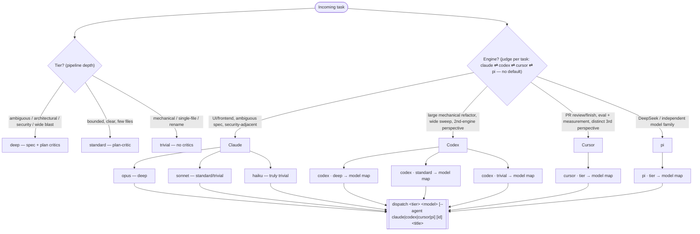

# Dispatch orchestration — the choosing tree

Canonical reference for how the dispatcher judges a task into **tier**, **engine**, and **model**. Keep it in sync with `DISPATCHER_PROTOCOL.md` (the baked rubric) and `dispatch.sh` (the mechanism).

## Model map (single source of truth)

The dispatcher picks the tier-appropriate model for the chosen engine from this
table. This table is the only place concrete **worker** model versions appear —
prose elsewhere says "the tier-appropriate model from the model map".
Orchestrator (dispatcher-session) defaults live in "Orchestrator engines" below;
consult-roster versions live in `WORKER_PROTOCOL.md` → "Orchestration consult".
Bump the matching table when a new model ships. The `refresh-scores` cache
(`~/.local/share/crew/model-scores.json`) is the external signal for when a
rung needs that bump — see `DISPATCHER_PROTOCOL.md` → "External standings".

**Burn classes.** Claude, Codex, and Cursor are subscriptions, so their cost is
quota burn. Pi/OpenRouter is usage-priced and is not represented in the quota
cache; judge its spend separately. Subscription rungs group into three classes:
**premium** — opus (fable ≈2× opus),
`gpt-5.6-sol`, `cursor-grok-4.6-high`; **standard** — sonnet, `gpt-5.6-terra`,
`cursor-grok-4.6-medium`; **cheap** — haiku, `gpt-5.6-luna`,
`cursor-grok-4.6-low`, `composer-2.5*` (free). Effort multiplies burn
within a rung (`xhigh`/`max`; codex `ultra` most). **Cursor `-fast` doubles the
token rate on top of that** ($2/M in + $6/M out standard against $4/M + $12/M
fast on Grok 4.6; 4.5 charges 3× on output), so it lifts a rung a whole class:
`-medium-fast` burns like premium `-high`, and `-low-fast` like standard. It is
a deliberate "I need this turn now" override, never the cheap lane. When the budget tightens
(`DISPATCHER_PROTOCOL.md` → "Budget is the fifth lever"), walk down a burn
class before walking down a tier — burn only sets model strength, tier sets
review depth.

| Tier       | claude (worker → execute → escalate) | codex (worker → execute → escalate) | cursor (worker → execute → escalate) | pi (lead + role grid) |
| ---------- | ------------------------------------ | ----------------------------------- | ------------------------------------ | --------------------- |
| `deep`     | **opus** → **sonnet** → escalated **opus**; use **`claude-fable-5-1`** only for genuinely hard, well-specified long-horizon work | **`gpt-5.6-sol`** → **terra** → escalated **sol** | **`kimi-k3-high`** → **`cursor-grok-4.6-medium`** → escalated **`cursor-grok-4.6-high`** | **`openrouter/deepseek/deepseek-v4-pro`** + spec-critic, plan-critic, reviewer panes |
| `standard` | **sonnet** → **sonnet** → escalated **opus** | **`gpt-5.6-terra`** → **luna** → escalated **terra** | **`cursor-grok-4.6-medium`** → **`cursor-grok-4.6-low`** → escalated **medium** | **`openrouter/deepseek/deepseek-v4.1-flash`** + plan-critic, reviewer panes |
| `trivial`  | **sonnet** (or **haiku**) — no delegation | **`gpt-5.6-luna`** — no delegation | **`cursor-grok-4.6-low`** — no delegation | **`openrouter/deepseek/deepseek-v4-flash`** — no grid |

Codex model ids carry a **variant suffix** — the 5.6 family ships as
`-sol` (frontier) / `-terra` (balanced everyday) / `-luna` (fast + affordable),
and there is **no bare `gpt-5.6`** — dispatching one dies on a 400, "model is not
supported when using Codex with a ChatGPT account". Authoritative list for this
account is `jq -r '.models[].slug' ~/.codex/models_cache.json` (also `gpt-5.5`,
`gpt-5.4`, `gpt-5.4-mini` — previous generations, no longer a rung here).

Codex reasoning effort still scales with tier automatically (deep→high,
standard→medium, trivial→low), independent of which gpt model is chosen. Above
`xhigh` the ladder continues with `max` (both engines) and codex-only `ultra`
(maximum reasoning with automatic task delegation) — `ultra` exists on `-sol` /
`-terra` only, `-luna` caps at `max`. Session effort `ultra` is itself an
orchestration layer: `dispatch` still enables `agents.*` but pins
`agents.default_subagent_reasoning_effort` one rung below the session (floor
`low`, **never** `ultra` — an ultra subagent would nest automatic delegation).
The worker must not add a second harness execute-subagent orchestration on top
of ultra's built-in delegation. See `WORKER_PROTOCOL.md` rule 1.

Both codex launch paths (`dispatch` workers and the `dispatcher --agent codex`
orchestrator) pin `service_tier="default"` — the interactive `/fast` toggle
persists locally and would otherwise leak into unattended runs, burning ChatGPT
credits at 2.5x for latency nobody is watching.
Cursor has **no reasoning-effort flag** — effort is baked into the model id
suffix and `dispatch`'s `--effort` is accepted-and-ignored for cursor. Grok
exposes both an effort suffix (`-low`/`-medium`/`-high`/`-xhigh`) and a speed
suffix (`-fast`), so the dispatcher expresses effort by _picking the id_. The
rows above name the **non-fast** slug on every tier: `-fast` is a paid speed
tier at ~2× the token rate, not a cheaper high-throughput one, so reach for it
only when a turn's latency actually matters and say why. cursor `deep`
uses **`kimi-k3-high`** as the worker (plans) and Grok as the execute ladder
(implements) — escalate to `cursor-grok-4.6-high`, not back to Kimi. **`kimi-k3`
has no lower-effort Cursor slug** (only `kimi-k3-high`). **Grok 4.6 remains the
default cursor distinct-implementer** — a genuinely non-Claude perspective, which
is the point of reaching for cursor. `--model` is open across cursor's whole
multi-vendor id space (the gate checks id _shape_, not membership of this
table), so a cursor worker can still front **`composer-2.5`** /
**`composer-2.5-fast`** (no effort variants) as an alternative on every tier,
or — on `deep` only, per the Tier map gate below — an effort-suffixed
`claude-opus-5-*` / `gpt-5.6-sol-*`. `dispatch` validates the model slot
against `--agent` before scaffolding — see **Model gate** below.

**Worker-session model vs execute-subagent model.** The first model in each map
cell is the **worker session** — it does spec / plan / reconcile / judging. The
second is the **default execute subagent**; the third is the escalated execute
rung for plan-tagged high-risk steps. Claude, Codex, and Cursor follow this split
on standard/deep (trivial does not delegate). See `WORKER_PROTOCOL.md` rule 1 (and
the fast deterministic gate + parallel review gate it describes). `dispatch.sh`
sets codex `agents.*` guardrails and a process-authority spawn clause only —
never model slugs for execute subagents (those stay in this table / rule 1).
Cursor has no CLI concurrency cap; the cap of 3 is protocol-only.

Pi has no native subagents. Standard and deep Pi dispatches therefore derive a
role grid automatically; the lead implements while separate panes provide the
fresh critic and reviewer contexts. `--roles` can override a role's engine and
model for deliberate cross-engine review.

**Bounded execute-time replanning.** A missing lower execute rung is a same-rung implementation fallback: it is not planning and does not consume the bounded re-plan budget. The provided/legacy contradiction fallback and a plan-shaped three-amendment recovery share exactly one execute-time budget. The latter must use a strictly higher planning tuple from the task file's authoritative engine/model/effort metadata; it never changes engines or skips a rung. Claude ascends `haiku → sonnet → opus → fable` (subject to the existing opus-to-fable eligibility check). Codex ascends effort `low → medium → high → xhigh → max`, then at max family `gpt-5.6-luna → gpt-5.6-terra → gpt-5.6-sol`; never ultra. Cursor ascends `cursor-grok-4.6-low → cursor-grok-4.6-medium → cursor-grok-4.6-high`. Claude fable/ineligible opus/unknown ids, codex sol/max or legacy/unknown/outside-table tuples, and cursor high/Kimi/Composer/cross-vendor/unknown ids are top/no-rung blocks, as are unavailable planning launches. The full auditable ledger, viability rule, and blocking evidence are in `WORKER_PROTOCOL.md` → “Bounded plan-shaped recovery”.

Pi has no fresh recovery-planner role in the current topology, so a
plan-shaped recovery on pi is an unavailable-planning block. The dispatcher
must supply a replacement; the lead cannot count self-replanning as independent.

**Shape-tag vocabulary.** The outcome log's `shape` field is a closed set:
`mechanical`, `ui`, `ambiguous`, `security`, `wide`.

**Orchestration consult (worker-side, deep).** Decomposition help from a top-tier consultant — **fable** (default), **gpt-5.6-sol** via the read-only codex MCP, or **cursor-grok-4.6-high** via a `cursor-agent -p` one-shot — is decided **in the worker's worktree** at the plan seam (whether *and* which), not by the dispatcher — the dispatcher's only lever is tiering the task `deep` (its existing "architectural / wide-blast" signal). Codex/cursor consults are work-profile only. See `WORKER_PROTOCOL.md` → "Orchestration consult". Every deep worker emits an outcome-metrics record to the bus at finish:
`crew msg worker:<branch> metrics:<crew_id> '{"consulted":…,"consult_engine":…,"plan_critic_first_pass":…,"rework_count":…,"replanned":…,"review_high":…}'`.
It rides `crew msg` (no `crew.sh` change) and never wakes the dispatcher. Consulted vs non-consulted deep workers are the A/B for whether the consult lever pays — `consult_engine` splits it by consultant — the counterfactual #86's oracle gate needs. Read it offline: `crew log <crew> | jq 'select(.to|startswith("metrics:"))'`.

Read `replanned` together with `rework_count`: it distinguishes ordinary mechanical gate convergence from an execute-time planning episode. Workers emit a complete latest-state metrics snapshot immediately before every stopping path; ratings select the latest timestamp. Old metrics bodies without `replanned` remain legacy-null in ratings.

### Model gate

`dispatch` validates `<model>` against `--agent` **before** it scaffolds
anything — no issue, no branch, no worktree, no window. It checks per-engine id
_shape_, not membership of the table above, so a model bump needs no
`dispatch.sh` edit — true for this gate; the Tier map gate below hand-copies
the same table and *does* need a `dispatch.sh` edit on a ladder bump (see
"Tier map" below):

- **claude** — an alias (`opus`, `sonnet`, `haiku`, `fable`) or a full
  `claude-*` id. An effort suffix is rejected: `claude-opus-5-high` is a
  _cursor_ id, and claude takes intensity through `--effort`.
- **codex** — `gpt-<gen>-<variant>`, variant mandatory, which is what rejects a
  bare `gpt-5.6`; `gpt-5.5` / `gpt-5.4` pass as legacy bare generations. When
  `$HOME/.codex/models_cache.json` is readable and holds a non-empty `.models`
  array, the slug must also appear in it — an absent or unusable cache is
  skipped, never fatal.
- **cursor** — an open multi-vendor id space, so shape is the floor: claude CLI
  aliases are rejected, and a `claude-*` / `gpt-*` id must carry an effort
  suffix (`gpt-5.6-sol-high`) or name one in a bracket block
  (`claude-opus-5[context=1m,effort=high,fast=false]`). The bracket rule is a
  conservative guess — `cursor-agent` calls the pairs "overrides", so a block
  that omits `effort=` may well be legitimate and still get rejected. That is
  what the override below is for.
  On top of shape, a **cached existence check** (#95) mirrors codex's: when
  `${XDG_DATA_HOME:-~/.local/share}/crew/cursor-models-cache.json` is readable,
  its `fetched_epoch` is within 24h, and it holds a non-empty `.models` array,
  a **non-bracketed** id must also appear in it — an absent, stale, or
  unusable cache is skipped, never fatal (same "degrade, never fail closed"
  posture as codex's). The 24h bound is deliberately far looser than the
  budget gate's 2h (below): a model catalog moves at the cadence of new
  releases (days-to-weeks), not quota's hour-to-hour churn, and a tight bound
  would leave this check degraded almost all the time between manual
  refreshes. **Bracketed ids are exempt from membership checking entirely** —
  a cell like `claude-opus-5[context=1m,effort=high,fast=false]` has a
  pre-bracket base (`claude-opus-5`) that is not itself an invocable slug
  (cursor resolves the real, effort-suffixed slug from the bracket's
  `effort=` param), so checking the base against the catalog would reject a
  legitimate dispatch rather than catch a bad one. The cache is built by the
  `refresh-models` CLI (`cursor-agent --list-models`, no JSON mode — parsed and
  cached; refresh by hand or at dispatcher session start, no daemon, same as
  `refresh-scores`/`refresh-budget`). It is **inert until run once**: nothing
  auto-populates the cache, so on a machine that has never run
  `refresh-models` this check is always degraded and only the shape floor
  applies — "fail fast on a dead id" starts working the first time a human (or
  the dispatcher session) runs it, not out of the box.
- **pi** — a provider-qualified id. The default OpenRouter ladder uses
  `openrouter/deepseek/<model>`; this shape and the concrete defaults were
  verified against `pi --list-models`.

The Model gate enforces **dispatchability**, not tier-appropriateness. The Tier
map gate below enforces **tier-appropriateness**; the map above stays the
source of truth for both.

**Override.** `DISPATCH_SKIP_MODEL_CHECK=<the exact model id>` skips the gate for
that one id and warns on stderr. Truthiness is exact string equality with the
model, not "is set" — exporting it for a session still gates every _other_
model. Reaching for it means **the map above is stale**: update the map in the
same session. The map is a protocol file, hot-reloadable through
`DISPATCHER_PROTOCOL_DIR`, so the doc fix lands immediately; the `dispatch.sh`
grammar follows on the next rebuild. This skip var covers the Model gate
(shape) only — it does not bypass the Tier map gate below. A genuinely new
model that is also a new tier's row additionally needs `--ignore-map` until
the Tier map's table and `dispatch.sh` are updated.

### Tier map

`dispatch` layers a second check on top of the Model gate above: once a model
clears dispatchability (shape), it must also be tier-appropriate for the
`(tier, engine)` pair. A model is accepted iff it is that tier's **worker** or
**execute** cell from the Model map above, **or** that tier's **escalate**
cell when the escalate cell is not burn-stronger (Burn classes, above) than
the worker cell — this is what excludes claude `standard`'s escalate (`opus`,
stronger than `standard`'s worker `sonnet`) while admitting every other row's
escalate, none of which strengthens beyond worker. On top of the map, a small
set of named exceptions apply: claude also accepts a full `claude-<alias>-*`
id for any alias already accepted at that tier, plus `fable`/`claude-fable-*`
on `deep` specifically (the map's own deep-cell prose escalation, above);
codex also accepts the three legacy bare generations (`gpt-5.5`, `gpt-5.4`,
`gpt-5.4-mini`) on every tier; cursor also accepts `composer-2.5` /
`composer-2.5-fast` on every tier, plus an effort-suffixed or bracketed
cross-vendor `claude-*`/`gpt-*` id (the shape the Model gate's cursor arm
already recognizes) on `deep` only. Pi accepts the OpenRouter DeepSeek worker
for its row plus the adjacent cheaper row on standard/deep, matching
`dispatch.sh` exactly.

Reject with the tier, the model given, the row's expected model(s) (rendered
from the Model map / Burn classes above), and `--ignore-map`.

**Override.** `--ignore-map` skips this gate for the dispatched model and is
**silent when set** — mirroring `--ignore-budget` exactly, not
`DISPATCH_SKIP_MODEL_CHECK`'s stderr notice (see "Override" under Model gate
above). Reaching for it is **the human's model decision**, the same framing
`DISPATCHER_PROTOCOL.md` uses for `--ignore-budget`'s "the human's spend
decision".

**Budget-aware rung refusal.** Layered above (checked after) the Tier map
gate itself, so an off-row model is rejected by the Tier map check first,
regardless of budget. `dispatch` refuses the premium rung for an engine when
its `7d` window is **both** ≥70% used **and** more than 15 points ahead of
pace — `used_pct` minus the window's elapsed fraction, `elapsed = clamp(100 *
(604800 - (resets_at - now)) / 604800, 0, 100)`. Because `used_pct` tops out
at 100 the inequality can't fire once elapsed reaches 85%, so a window
inside its own last 15% (~25h on `7d`) stops refusing on its own — that's the
near-reset exemption, not a second rule to keep in sync. A null `resets_at`
means pace isn't computable and the gate falls back to the flat ≥70 rule it
always had. Either way it names the downgrade target below — before the
engine goes fully dark at the existing ≥95% gate (`DISPATCHER_PROTOCOL.md` →
"Budget is the fifth lever"). Two overrides, different blast radii:
`DISPATCH_IGNORE_RUNG=<the exact model id>` bypasses just this refusal for
that one dispatched model and leaves the ≥95% stop armed — the escape an
agent can actually reach for, since `--ignore-budget` reads as spend
authorization to the auto-mode classifier and a dispatcher agent can't pass
it; `--ignore-budget` still bypasses both this gate and the ≥95% stop, and
remains the human's spend decision.

| engine | premium                                        | downgrade target        |
| ------ | ----------------------------------------------- | ------------------------ |
| claude | `opus`, `claude-opus-*`, `fable`, `claude-fable-*` | `sonnet`                 |
| codex  | `gpt-5.6-sol`                                    | `gpt-5.6-terra`          |
| cursor | `cursor-grok-4.6-high`                           | `cursor-grok-4.6-medium` |

## Orchestrator engines (dispatcher session)

The dispatcher itself can run on any engine —
`dispatcher --agent claude|codex|cursor|pi`. Codex and Cursor are work-profile
gated; pi is all-profile. Orchestrator defaults — bump this table when a model
ships:

| engine | model | effort |
| ------ | ----- | ------ |
| claude | **opus** | **high** — not xhigh, for the same bounded-wait reason as codex |
| codex | **gpt-5.6-sol** | **high** — not xhigh: blocked workers wait on a bounded ~300s in-band window |
| cursor | **kimi-k3-high** | fixed in the model id (no knob; `--model` overrides: composer-2.5, cursor-grok-4.6-*) |
| pi | work **`openrouter/deepseek/deepseek-v4-pro`** · personal **`opencode/deepseek-v4-pro`** (profile-keyed) | **high** through `--thinking` |

All four rows are pinned in `dispatcher.sh`, claude included — `/model` and
`/effort` persist across sessions, so an unpinned claude dispatcher would inherit
whatever a previous cheap session left set and judge the whole fan-out on it.
The `pi` row is **profile-keyed**: `dispatcher.sh`'s `pi)` branch defaults to
`openrouter/deepseek/deepseek-v4-pro` on the work profile and
`opencode/deepseek-v4-pro` on personal; `--model` overrides either.
`--model` / `--effort` still override per launch.

Claude and pi bake `DISPATCHER_PROTOCOL.md` as a system prompt; codex/cursor
inject it as the first prompt. The judging rubric
is identical across engines; the crew-watch park primitive is not — see
`DISPATCHER_PROTOCOL.md` → "Read the bus".

## Three orthogonal levers

- **Tier = pipeline depth (who reviews).** Driven by risk/ambiguity/blast-radius, not size. A one-line security change is still `standard`/`deep`. Pipeline depth also flexes **down** when the target repo self-reviews: a repo with an active automated PR-review gauntlet permits a light internal pass except for cross-component correctness risk, which promotes one reviewer per `EVIDENCE_REVIEW.md` (see `WORKER_PROTOCOL.md` → Code review gate, "Repo-aware scaling"). Targeted re-review after behavioral fixes still applies. Tier sets *planning* depth regardless — review scaling does not rewrite the spec or plan.
- **Engine = who implements.** Judged per task (claude ⇄ codex ⇄ cursor ⇄ pi) — no default, and **on neutral fit rotate to the least-recently-dispatched engine** rather than drifting back to claude (see `DISPATCHER_PROTOCOL.md` engine lever). Pi supplies an independent DeepSeek/OpenRouter family and automatically gets external critic/reviewer panes on standard/deep; the other routing preferences remain in `DISPATCHER_PROTOCOL.md`.
- **Model/effort = how strong / how hard it thinks.** All engines pick the tier-appropriate model from the model map. Claude, codex, and pi have explicit effort knobs; cursor folds effort into the model id.

## MCP is no longer a routing factor

Configured engines defer MCP tool schemas, so the base stack is ~free until a tool is used:

- **Claude** — deferred by default via tool-search (haiku is the one eager exception).
- **Codex** — schemas deferred (baked-in `always_defer_mcp_tools`; measured ~0 token cost), browsers launch lazily on first use, and the base stack is provisioned from the same `mcp-servers.nix` source via the nix-generated `--profile worker`.
- **Cursor** — base stack comes from the single shared `~/.cursor/mcp.json` (same `mcp-servers.nix` source); there's no per-invocation MCP-config flag, so there's no separate worker profile. The dispatch launch passes `--approve-mcps` for unattended auto-approval. Codebase **indexing is disabled** (`--disable-indexing --disable-codebase-ref`, `CURSOR_CLI_INDEXED_GREP=0`) for parity with claude/codex (read + grep, no semantic index) and to skip a merkle index build over a large monorepo — not as a stall fix. The worker runs **cursor's interactive TUI** (a bare prompt argument, no `-p`), like the claude and codex launches: it repaints as it works, so the pane stays a truthful liveness signal for the stall watchdog and legible to a human. Headless `-p` is wrong for a worker — `--output-format text` prints only the final message, so a running worker reads as a wedge (the real #103), and `stream-json` only cures that by relaying events through a formatter. `-p` is still right for one-shot consults, where stdout is the product.
- **Pi** — uses its own global provider/tool configuration. Dispatcher does not
  synthesize an MCP profile for it.

The additive `--mcp analytics` profile stays claude-only; every non-Claude
engine rejects `--mcp`.
