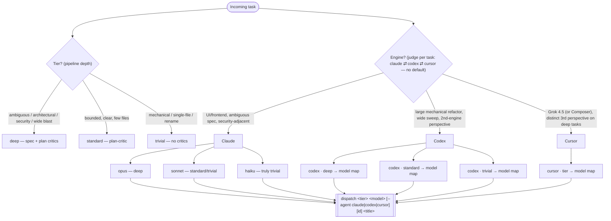

# Dispatch orchestration — the choosing tree

Canonical reference for how the dispatcher judges a task into **tier**, **engine**, and **model**. Keep it in sync with `DISPATCHER_PROTOCOL.md` (the baked rubric) and `dispatch.sh` (the mechanism).

## Model map (single source of truth)

The dispatcher picks the tier-appropriate model for the chosen engine from this
table. This table is the only place concrete **worker** model versions appear —
prose elsewhere says "the tier-appropriate model from the model map".
Orchestrator (dispatcher-session) defaults live in "Orchestrator engines" below;
consult-roster versions live in `WORKER_PROTOCOL.md` → "Orchestration consult".
Bump the matching table when a new model ships. The `refresh-scores` cache
(`~/.local/share/crew/model-scores.json`) is the external signal for when a
rung needs that bump — see `DISPATCHER_PROTOCOL.md` → "External standings".

| Tier       | claude ladder                                                                                                                                                                                                                                                            | codex ladder      | cursor ladder           |
| ---------- | ------------------------------------------------------------------------------------------------------------------------------------------------------------------------------------------------------------------------------------------------------------------------ | ----------------- | ----------------------- |
| `deep`     | **opus** — escalate to **`claude-fable-5`** only for a genuinely hard, well-specified, long-horizon task where opus is demonstrably not enough (≈2× opus cost, refusal-classifier risk on security-adjacent code, minutes-long turns; most expensive lever, used rarely) | **`gpt-5.6-sol`**   | **`cursor-grok-4.5-high`**        |
| `standard` | **sonnet**                                                                                                                                                                                                                                                               | **`gpt-5.6-terra`** | **`cursor-grok-4.5-medium-fast`** |
| `trivial`  | **sonnet** (or **haiku** if truly trivial)                                                                                                                                                                                                                               | **`gpt-5.6-luna`**  | **`cursor-grok-4.5-low-fast`**    |

Codex model ids carry a **variant suffix** — the 5.6 family ships as
`-sol` (frontier) / `-terra` (balanced everyday) / `-luna` (fast + affordable),
and there is **no bare `gpt-5.6`** — dispatching one dies on a 400, "model is not
supported when using Codex with a ChatGPT account". Authoritative list for this
account is `jq -r '.models[].slug' ~/.codex/models_cache.json` (also `gpt-5.5`,
`gpt-5.4`, `gpt-5.4-mini` — previous generations, no longer a rung here).

Codex reasoning effort still scales with tier automatically (deep→high,
standard→medium, trivial→low), independent of which gpt model is chosen. Above
`xhigh` the ladder continues with `max` (both engines) and codex-only `ultra`
(maximum reasoning with automatic task delegation) — `ultra` exists on `-sol` /
`-terra` only, `-luna` caps at `max`.

Both codex launch paths (`dispatch` workers and the `dispatcher --agent codex`
orchestrator) pin `service_tier="default"` — the interactive `/fast` toggle
persists locally and would otherwise leak into unattended runs, burning ChatGPT
credits at 2.5x for latency nobody is watching.
Cursor has **no reasoning-effort flag** — effort is baked into the model id
suffix and `dispatch`'s `--effort` is accepted-and-ignored for cursor. Grok
exposes both an effort suffix (`-low`/`-medium`/`-high`) and a throughput
suffix (`-fast`), so the dispatcher expresses effort by _picking the id_: the
standard/trivial rows use `-fast` for cheap, high-throughput turns; `deep` drops
`-fast` for the fuller pass. **Grok 4.5 is the default cursor distinct-implementer**
— a genuinely non-Claude perspective, which is the point of reaching for cursor.
`--model` is free, so a cursor worker can still front **`composer-2.5`** /
**`composer-2.5-fast`** (no effort variants) as an alternative, or an
effort-suffixed `claude-opus-4-8-*` / `gpt-5.6-sol-*`. `dispatch` does not
validate the model slot — the map is enforced by the dispatcher's judgment, not
by code.

**Worker-session model vs execute-subagent model (claude).** The `<model>` in the map above is the **worker session** model — it does spec / plan / reconcile / judging (opus on deep). The worker's **execute subagents default to sonnet**, escalating a single step to opus only when the plan tags it `implement: opus`. So a deep claude worker is opus-orchestrated but sonnet-implemented by default. See `WORKER_PROTOCOL.md` rule 1 (and the fast deterministic gate + parallel review gate it now describes). Codex workers scale reasoning effort by tier instead — the split is claude-specific.

**Shape-tag vocabulary.** The outcome log's `shape` field is a closed set:
`mechanical`, `ui`, `ambiguous`, `security`, `wide`.

**Orchestration consult (worker-side, deep).** Decomposition help from a top-tier consultant — **fable** (default), **gpt-5.6-sol** via the read-only codex MCP, or **cursor-grok-4.5-high** via a `cursor-agent -p` one-shot — is decided **in the worker's worktree** at the plan seam (whether *and* which), not by the dispatcher — the dispatcher's only lever is tiering the task `deep` (its existing "architectural / wide-blast" signal). Codex/cursor consults are work-profile only. See `WORKER_PROTOCOL.md` → "Orchestration consult". Every deep worker emits an outcome-metrics record to the bus at finish:
`crew msg worker:<branch> metrics:<crew_id> '{"consulted":…,"consult_engine":…,"plan_critic_first_pass":…,"rework_count":…,"review_high":…}'`.
It rides `crew msg` (no `crew.sh` change) and never wakes the dispatcher. Consulted vs non-consulted deep workers are the A/B for whether the consult lever pays — `consult_engine` splits it by consultant — the counterfactual #86's oracle gate needs. Read it offline: `crew log <crew> | jq 'select(.to|startswith("metrics:"))'`.

## Orchestrator engines (dispatcher session)

The dispatcher itself can run on any engine — `dispatcher --agent claude|codex|cursor`
(work-profile gated, same as workers). Orchestrator defaults — bump this table when a
model ships:

| engine | model | effort |
| ------ | ----- | ------ |
| claude | opus (settings default) | settings default |
| codex | **gpt-5.6-sol** | **high** — not xhigh: blocked workers wait on a bounded ~300s in-band window |
| cursor | **kimi-k3-high** | fixed in the model id (no knob; `--model` overrides: composer-2.5, cursor-grok-4.5-*) |

claude bakes `DISPATCHER_PROTOCOL.md` as a system prompt; codex/cursor inject it as
the first prompt (neither CLI has an append-system-prompt flag). The judging rubric
is identical across engines; the crew-watch park primitive is not — see
`DISPATCHER_PROTOCOL.md` → "Read the bus".

## Three orthogonal levers

- **Tier = pipeline depth (who reviews).** Driven by risk/ambiguity/blast-radius, not size. A one-line security change is still `standard`/`deep`. Pipeline depth also flexes **down** when the target repo self-reviews: a repo with its own automated PR-review gauntlet (Cursor Bugbot / Codex / a review GitHub App) on top of CI makes the worker's internal model review largely redundant, so the worker downgrades it (see `WORKER_PROTOCOL.md` → Code review gate, "Repo-aware scaling"). `mono` is such a repo. Tier still sets *planning* depth regardless — the downgrade only touches the post-execute review.
- **Engine = who implements.** Judged per task (claude ⇄ codex ⇄ cursor) — no default, and **on neutral fit rotate to the least-recently-dispatched engine** rather than drifting back to claude (see `DISPATCHER_PROTOCOL.md` engine lever). Codex (work profile only) for large mechanical refactors, wide sweeps, or a deliberate second-engine perspective; cursor (work profile only) for a distinct third-engine perspective on deep tasks — default it to **Grok 4.5** (`cursor-grok-4.5-*`), genuinely non-Claude; Composer stays available as an alternative; claude for UI/frontend work, security-adjacent code, or _genuinely_ underspecified work (mild ambiguity alone isn't a claude ticket). Soft rule: don't front Claude _through_ cursor when the point is an independent third perspective — a cursor-fronted sonnet isn't independent review of a claude worker; use a Grok (or Composer) model for that.
- **Model/effort = how strong / how hard it thinks.** All engines pick the tier-appropriate model from the model map; codex reasoning effort scales with tier (deep→high, standard→medium, trivial→low) independent of which model is chosen, while cursor folds effort into the model id (no separate knob).

## MCP is no longer a routing factor

All engines defer MCP tool schemas, so the base stack (context7, playwright, firefox-devtools) is ~free until a tool is used:

- **Claude** — deferred by default via tool-search (haiku is the one eager exception).
- **Codex** — schemas deferred (baked-in `always_defer_mcp_tools`; measured ~0 token cost), browsers launch lazily on first use, and the base stack is provisioned from the same `mcp-servers.nix` source via the nix-generated `--profile worker`.
- **Cursor** — base stack comes from the single shared `~/.cursor/mcp.json` (same `mcp-servers.nix` source); there's no per-invocation MCP-config flag, so there's no separate worker profile. The dispatch launch passes `--approve-mcps` for unattended auto-approval. Codebase **indexing is disabled** (`--disable-indexing --disable-codebase-ref`, `CURSOR_CLI_INDEXED_GREP=0`) for parity with claude/codex (read + grep, no semantic index) and to skip a merkle index build over a large monorepo — not as a stall fix. The worker runs **cursor's interactive TUI** (a bare prompt argument, no `-p`), like the claude and codex launches: it repaints as it works, so the pane stays a truthful liveness signal for the stall watchdog and legible to a human. Headless `-p` is wrong for a worker — `--output-format text` prints only the final message, so a running worker reads as a wedge (the real #103), and `stream-json` only cures that by relaying events through a formatter. `-p` is still right for one-shot consults, where stdout is the product.

The additive `--mcp analytics` (posthog, work) profile stays claude-only — for codex _and_ cursor `--mcp` is rejected; their base MCP comes from their own profile. `cad`/freecad was dropped.
