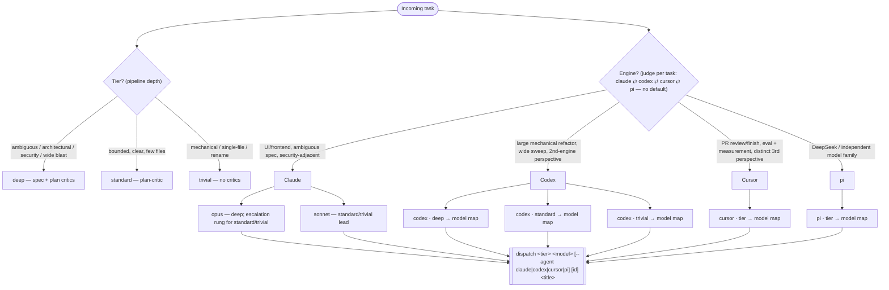

# Dispatch orchestration — the choosing tree

Canonical reference for how the dispatcher judges a task into **tier**, **engine**, and **model**. Keep it in sync with `DISPATCHER_PROTOCOL.md` (the baked rubric), `adapters/core/defaults.json` (the map's data), and `dispatch.sh` (the mechanism).


```mermaid
flowchart TD
    T(["Incoming task"]) --> TIER{"Tier? (pipeline depth)"}
    T --> ENG{"Engine? (judge per task: claude ⇄ codex ⇄ cursor ⇄ pi — no default)"}

    TIER -->|"ambiguous / architectural / security / wide blast"| DEEP["deep — spec + plan critics"]
    TIER -->|"bounded, clear, few files"| STD["standard — plan-critic"]
    TIER -->|"mechanical / single-file / rename"| TRIV["trivial — no critics"]

    ENG -->|"large mechanical refactor, wide sweep, 2nd-engine perspective"| CODEX["Codex"]
    ENG -->|"UI/frontend, ambiguous spec, security-adjacent"| CLAUDE["Claude"]
    ENG -->|"PR review/finish, eval + measurement, distinct 3rd perspective"| CURSOR["Cursor"]
    ENG -->|"DeepSeek / independent model family"| PI["pi"]

    CLAUDE --> OPUS["opus — deep; escalation rung for standard/trivial"]
    CLAUDE --> SONNET["sonnet — standard/trivial lead"]
    CODEX --> GH["codex · deep → model map"]
    CODEX --> GM["codex · standard → model map"]
    CODEX --> GL["codex · trivial → model map"]
    CURSOR --> CU["cursor · tier → model map"]
    PI --> PM["pi · tier → model map"]

    OPUS --> D[["dispatch &lt;tier&gt; &lt;model&gt; [--agent claude|codex|cursor|pi] [id] &lt;title&gt;"]]
    SONNET --> D
    GH --> D
    GM --> D
    GL --> D
    CU --> D
    PM --> D
```

## Model map (single source of truth)

The dispatcher picks the tier-appropriate model for the chosen engine from this
table. This table is the only place concrete **worker** model versions appear —
prose elsewhere says "the tier-appropriate model from the model map".
The rows the Tier map gate enforces are data in `adapters/core/defaults.json`;
the tables under "Tier map" are generated from it and the first model in each
cell below is checked against it.
Orchestrator (dispatcher-session) defaults live in "Orchestrator engines" below;
consult-roster versions live in `WORKER_PROTOCOL.md` → "Orchestration consult".
Bump the matching table when a new model ships. The `refresh-scores` cache
(`~/.local/share/crew/model-scores.json`) is the external signal for when a
rung needs that bump — see `DISPATCHER_PROTOCOL.md` → "External standings".

**Burn classes.** Claude, Codex, and Cursor are subscriptions, so their cost is
quota burn. Pi/OpenRouter is usage-priced; once a key is configured it's
represented as `engines.pi` (month-to-date spend vs an optional monthly
target, not a quota window) — a pi run on the Flash rungs is roughly $0.5–2
per Flash run, which is what makes pi the cheap lane to shed claude burn
onto. Subscription rungs group into three classes:
**premium** — opus at `high`+
(fable ≈2–4× opus per task), `gpt-5.6-sol`, `grok-4.7-high`; **standard** — opus at
`low`/`medium`, sonnet, `gpt-5.6-terra`, `grok-4.7-medium`; **cheap** — haiku,
`gpt-5.6-luna`, `grok-4.7-low`, `composer-2.5*` (free). Effort multiplies burn
within a rung (`xhigh`/`max`; codex `ultra` most); opus's class follows effort
(`low`/`medium` → standard, `high` → premium, `xhigh`/`max` → premium and
heavier). **Cursor `-fast` doubles the
token rate on top of that** ($2/M in + $6/M out standard against $4/M + $12/M
fast on Grok 4.7 and 4.6; 4.5 charges 3× on output), so it lifts a rung a whole class:
`-medium-fast` burns like premium `-high`, and `-low-fast` like standard. It is
a deliberate "I need this turn now" override, never the cheap lane. When the budget tightens
(`DISPATCHER_PROTOCOL.md` → "Budget is the fifth lever"), walk down a burn
class before walking down a tier — burn only sets model strength, tier sets
review depth.

| Tier       | claude (worker → execute → escalate) | codex (worker → execute → escalate) | cursor (worker → execute → escalate) | pi (lead + role grid) |
| ---------- | ------------------------------------ | ----------------------------------- | ------------------------------------ | --------------------- |
| `deep`     | **opus** → **sonnet** (mechanical plan steps may run on **haiku**, never the lead) → escalated **opus**; escalate to **`claude-fable-5-1`** only as a last resort after opus @**`xhigh`** has failed on hard architecture/complex-bug work | **`gpt-5.6-sol`** → **terra** → escalated **sol** | **`kimi-k3-high`** → **`grok-4.7-medium`** → escalated **`grok-4.7-high`** | **`openrouter/deepseek/deepseek-v4.1-flash`** + spec-critic, plan-critic, reviewer panes |
| `standard` | **sonnet** @**medium** → **sonnet** (mechanical plan steps may run on **haiku**, never the lead) → escalated **opus** @**medium**; opus stays admitted in the row as the one-rung escalation; security-adjacent work leads on **opus** @**medium** (Sonnet 5.5's safeguard fallback is Sonnet 5 with thinking disabled) | **`gpt-5.6-terra`** → **luna** → escalated **terra** | **`grok-4.7-medium`** → **`grok-4.7-low`** → escalated **medium** | **`openrouter/deepseek/deepseek-v4.1-flash`** + plan-critic, reviewer panes; rotation alternatives **`openrouter/z-ai/glm-5.3-flash`**, **`openrouter/qwen/qwen3.8-flash`** |
| `trivial`  | **sonnet** @**low** → escalated **opus** @**low**; **haiku** @**low** (`claude-haiku-5-5`) may lead when the edit is fully specified (rule below), escalating **haiku → sonnet** — no delegation | **`gpt-5.6-luna`** — no delegation | **`grok-4.7-low`** — no delegation | **`openrouter/deepseek/deepseek-v4-flash`** — no grid; **`openrouter/deepseek/deepseek-v4.1-flash`** also accepted |
| local      | — | — | — | ids from the `localModels` setting (trivial/standard by default) — see "Local models" |

On claude `standard`/`trivial`, sonnet leads at the tier-typical effort (`medium` / `low`), and an opus escalation runs at that same effort, never deep's `high` by habit; raise either only on the signals in `DISPATCHER_PROTOCOL.md` → "Effort is a sixth lever". On sonnet the ceiling is `high`: `dispatch` refuses sonnet @`xhigh`/`max`, and the next step past sonnet@`high` is opus@`medium` (standard), never sonnet `xhigh`/`max`. When the budget pace gate refuses opus, the fallback is `sonnet` at the same effort — or `sonnet at high` when the refused effort was `xhigh`/`max` (sonnet's ceiling) — not opus at a lower effort. An opus launch at `low`/`medium` is *not* refused as a premium model rung — its burn class follows effort and it counts as standard (Burn classes) — while `high` and above still refuse.

**When haiku replaces sonnet.** Haiku 5.5 (`claude-haiku-5-5`, alias `haiku`; verified: the alias resolves to it and it accepts `low` through `max` effort, default `medium`) stands in for sonnet only when the work is mechanical and bounded, not security-adjacent, not UI, and fully specified: the exact file and exact edit are named (a lockfile regen, a literal typo, a mechanical rename) and no choice is left. A `trivial` task that still needs reading code to decide the edit stays on sonnet. Sonnet stays the typical launch on `trivial` and `standard`. Haiku never leads `standard`/`deep` (the gate does not admit it there); on those tiers it is only an execute-subagent model (Agent `model: haiku`) for plan steps that are purely mechanical, and any step with judgment stays on sonnet. Any doubt, or a failed haiku run, goes to sonnet (`haiku → sonnet` escalation). Haiku has no effort ceiling to enforce: it accepts every level, so the gate refuses none; launch it at `low` and do not raise effort to compensate for a task that needs judgment, escalate the model instead.

**Every `deep` row also grids by default** — claude, codex, and cursor each pick up `spec-critic,plan-critic` panes (critics only; their native code-review batch is unchanged), all on the lead's own engine and model unless `--roles` says otherwise. Pi's `deep` cell keeps its full `spec-critic,plan-critic,reviewer` grid — its `reviewer` pane is the review gate, having no native batch of its own — and only pi grids on `standard` too.

**Pi effort.** Pi's tier-typical effort is **`high` for `trivial`, `high` for `standard`,
and `max` for `deep`** — the lever that separates pi `standard` from `deep`
now that both use `deepseek-v4.1-flash`. The DeepSeek Flash maps have holes, so
the generic `trivial`→`low` / `standard`→`medium` rungs clamp up to `high` on
their tier-typical models anyway (V4 Flash exposes `off`/`high`/`xhigh`; V4.1
Flash exposes `off`/`low`/`high`/`max`, so deep's `max` is passed through directly).
Pi clamps `--thinking` per model through that model's `thinkingLevelMap` —
generic logic, not DeepSeek-specific — so the rotation alternatives behave the
same way: `openrouter/z-ai/glm-5.3-flash` exposes `low`/`high`/`max`, while
`openrouter/qwen/qwen3.8-flash` carries no map and supports through `high`.
Pi deep has no higher pi model rung: after a failed deep pi worker, the
dispatcher re-dispatches on another engine by judgement. The same holds for
`EVIDENCE_REVIEW.md`'s reviewer promotion, which on pi is a `reviewer` pane at
`max` effort on a model whose thinking map exposes `max`, or on another
engine's escalate rung (`--roles reviewer=<agent>:<model>@<effort>`). None of this needs new clamp
machinery — every id launches with the standard ladder.

Codex model ids carry a **variant suffix** — the 5.6 family ships as
`-sol` (frontier) / `-terra` (balanced everyday) / `-luna` (fast + affordable),
and there is **no bare `gpt-5.6`** — dispatching one dies on a 400, "model is not
supported when using Codex with a ChatGPT account". Authoritative list for this
account is `jq -r '.models[].slug' ~/.codex/models_cache.json` (also `gpt-5.5`,
`gpt-5.4`, `gpt-5.4-mini` — previous generations, no longer a rung here).

Codex's tier-typical rung (deep→high, standard→medium, trivial→low) is the
starting point, independent of which gpt model is chosen — not an automatic
default: `--effort` is a required flag `dispatch` refuses to scaffold without
(`dispatch.sh:532-533`), and the dispatcher departs from the tier-typical rung
on the raise/hold signals in `DISPATCHER_PROTOCOL.md` → "Effort is a sixth
lever". Above `xhigh` the ladder continues with `max` (both engines) and
codex-only `ultra`
(maximum reasoning with automatic task delegation) — `ultra` exists on `-sol` /
`-terra` only, `-luna` caps at `max`. Session effort `ultra` is itself an
orchestration layer: `dispatch` still enables `agents.*` but pins
`agents.default_subagent_reasoning_effort` one rung below the session (floor
`low`, **never** `ultra` — an ultra subagent would nest automatic delegation).
The worker must not add a second harness execute-subagent orchestration on top
of ultra's built-in delegation. See `WORKER_PROTOCOL.md` rule 1.

Both codex launch paths (`dispatch` workers and the `dispatcher --agent codex`
orchestrator) pin `service_tier="default"` — the interactive `/fast` toggle
persists locally and would otherwise leak into unattended runs, burning ChatGPT
credits at 2.5x for latency nobody is watching.
Cursor has **no reasoning-effort flag** — effort is baked into the model id
suffix and `dispatch`'s `--effort` is accepted-and-ignored for cursor. Grok
exposes both an effort suffix (`-low`/`-medium`/`-high`/`-xhigh`) and a speed
suffix (`-fast`), so the dispatcher expresses effort by _picking the id_. The
rows above name the **non-fast** slug on every tier: `-fast` is a paid speed
tier at ~2× the token rate, not a cheaper high-throughput one, so reach for it
only when a turn's latency actually matters and say why. cursor `deep`
uses **`kimi-k3-high`** as the worker (plans) and Grok as the execute ladder
(implements) — escalate to `grok-4.7-high`, not back to Kimi (a launch id; in-session Task spawns resolve through "Cursor Task-spawn slugs"). Grok 4.7 ids
drop the `cursor-` prefix 4.6 carried (`grok-4.7-medium`, not
`cursor-grok-4.7-medium`); the gate still accepts `cursor-grok-4.6-*` so a
pinned 4.6 run keeps dispatching. **Grok 4.7 is the
default cursor distinct-implementer** — a genuinely non-Claude perspective, which
is the point of reaching for cursor. `--model` is open across cursor's whole
multi-vendor id space (the gate checks id _shape_, not membership of this
table), so a cursor worker can still front **`composer-2.5`** /
**`composer-2.5-fast`** (no effort variants) as an alternative on every tier,
or — on `deep` only, per the Tier map gate below — an effort-suffixed
`claude-opus-5-*` / `gpt-5.6-sol-*`. `dispatch` validates the model slot
against `--agent` before scaffolding — see **Model gate** below.

**Worker-session model vs execute-subagent model.** The first model in each map
cell is the **worker session** — it does spec / plan / reconcile / judging. The
second is the **default execute subagent**; the third is the escalated execute
rung for plan-tagged high-risk steps. Claude, Codex, and Cursor follow this split
on standard/deep (trivial does not delegate). See `WORKER_PROTOCOL.md` rule 1 (and
the fast deterministic gate + parallel review gate it describes). `dispatch.sh`
sets codex `agents.*` guardrails and a process-authority spawn clause only —
never model slugs for execute subagents (those stay in this table / rule 1).
Cursor has no CLI concurrency cap; the cap of 3 is protocol-only.

The role grid is now the **default on `deep`, on every engine** — not only
pi's. For **claude/codex/cursor** the default grid is **critics only**
(`spec-critic,plan-critic`, no `reviewer`): those engines already run a full
native reviewer-roster batch at the code-review gate (`WORKER_PROTOCOL.md` →
"Code review gate"), and a default grid must not silently replace it — the
grid gives them fresh out-of-process contexts for the spec/plan critics only.
**Pi** has no native subagents at all — its `reviewer` pane **is** the review
gate, so pi's default is unchanged: `standard` → `plan-critic,reviewer`,
`deep` → `spec-critic,plan-critic,reviewer`. With no `--roles` given, every
role pane inherits the lead's own agent and model (the **single-engine
fallback**): a claude-only host still gets its critic panes, all on claude,
and dispatch never refuses or reaches for an engine the caller didn't ask
for. A `--review` worker has no spec/plan phase to critique, so it gets no
critic grid: non-pi review workers get none at all (native batch and refuters),
while a pi review worker above `trivial` defaults to `reviewer,refuter` panes —
pi cannot fan out the reviewer batch and per-finding refuters
`REVIEW_TASK.md` requires, and its `--no-grid` refusal covers it too. A non-pi
`deep` dispatch under `--plan provided` also gets no default grid (nothing left
for spec/plan critics to check). `--roles` opts into deliberate
cross-engine review, including adding a `reviewer` pane on a non-pi lead —
that pane is **additive**, a second opinion alongside the native batch, never
a replacement (`reviewer=codex:gpt-5.6-sol`). `--grid`, passed explicitly,
keeps its original meaning regardless of engine or `--plan`: the full
tier-derived topology (`standard` → `plan-critic,reviewer`, `deep` →
`spec-critic,plan-critic,reviewer`; on a `--review` worker `reviewer,refuter`
for both) — only the *default* trigger is critics-only for non-pi. `--no-grid` opts back out of the default on any
non-pi engine, and is refused for pi standard/deep — pi has no other way to
get a fresh critic/reviewer context. `--no-grid` combined with `--grid` or
`--roles` is a usage error.

`--lazy` records whichever topology resolves — explicit or the engine/tier
default above — without creating any panes; the lead materializes each role
with `dispatch --spawn-role <role>` at its seam and may `dispatch
--reap-roles` when done (see `WORKER_PROTOCOL.md` → "Grid mode"). It needs no
`--grid`/`--roles` of its own when a default already resolves one (non-pi
`deep`, pi standard/deep) — adding `--grid` there would change the topology
itself (adding `reviewer` on non-pi deep), not just make it lazy. **The
default topology stays eager**: both non-pi deep default roles are used by
any task that reaches its plan seam, so laziness only defers a one-time
startup-read cost, not a permanent saving; pi's `reviewer` pane is its only
review gate, so a lazy pi grid nobody spawns ships with no review at all.
`--lazy` is a deliberate per-dispatch opt-in (see `DISPATCHER_PROTOCOL.md` →
"Lazy grid"), never a default.

**Bounded execute-time replanning.** A missing lower execute rung is a same-rung implementation fallback: it is not planning and does not consume the bounded re-plan budget. The provided/legacy contradiction fallback and a plan-shaped three-amendment recovery share exactly one execute-time budget. The latter must use a strictly higher planning tuple from the task file's authoritative engine/model/effort metadata; it never changes engines or skips a rung; a same-or-higher Grok substitute for a refused next rung is not a skipped rung. Claude ascends `haiku → sonnet → opus → fable` (subject to the existing opus-to-fable eligibility check). Codex ascends effort `low → medium → high → xhigh → max`, then at max family `gpt-5.6-luna → gpt-5.6-terra → gpt-5.6-sol`; never ultra. Cursor ascends `grok-4.7-low → grok-4.7-medium → grok-4.7-high`. Claude fable/ineligible opus/unknown ids, codex sol/max or legacy/unknown/outside-table tuples, and cursor high/Kimi/Composer/cross-vendor/unknown ids are top/no-rung blocks, as are unavailable planning launches. A cursor Task-slug refusal takes the substitution rule in “Cursor Task-spawn slugs” first. The full auditable ledger, viability rule, and blocking evidence are in `WORKER_PROTOCOL.md` → “Bounded plan-shaped recovery”.

Pi has no fresh recovery-planner role in the current topology, so a
plan-shaped recovery on pi is an unavailable-planning block. The dispatcher
must supply a replacement; the lead cannot count self-replanning as independent.

**Shape-tag vocabulary.** The outcome log's `shape` field is a closed set:
`mechanical`, `ui`, `ambiguous`, `security`, `wide`.

**Orchestration consult (worker-side, deep).** Decomposition help from a top-tier consultant — **opus** (neutral-fit default), **fable** (architecture-heavy decompositions), **gpt-5.6-sol**, or **grok-4.7-high** — is decided **in the worker's worktree** at the plan seam (whether *and* which), not by the dispatcher — the dispatcher's only lever is tiering the task `deep` (its existing "architectural / wide-blast" signal). Every consultant is reachable from any lead engine as a read-only shell one-shot gated on `dispatch --engines --in-budget` (the machine-local roster minus engines at ≥95% or a limit); the Agent-tool (fable) and codex-MCP (gpt-5.6-sol) forms stay claude-lead conveniences. See `WORKER_PROTOCOL.md` → "Orchestration consult" and "Cross-engine one-shots". Every deep worker emits an outcome-metrics record to the bus at finish:
`crew msg worker:<branch> metrics:<crew_id> '{"consulted":…,"consult_engine":…,"plan_critic_first_pass":…,"rework_count":…,"replanned":…,"review_high":…}'`.
It rides `crew msg` (no `crew.sh` change) and never wakes the dispatcher. Consulted vs non-consulted deep workers are the A/B for whether the consult lever pays — `consult_engine` splits it by consultant — the counterfactual #86's oracle gate needs. Read it offline: `crew log <crew> | jq 'select(.to|startswith("metrics:"))'`.

Read `replanned` together with `rework_count`: it distinguishes ordinary mechanical gate convergence from an execute-time planning episode. Workers emit a complete latest-state metrics snapshot immediately before every stopping path; ratings select the latest timestamp. Old metrics bodies without `replanned` remain legacy-null in ratings.

### Model gate

`dispatch` validates `<model>` against `--agent` **before** it scaffolds
anything — no issue, no branch, no worktree, no window. It checks per-engine id
_shape_, not membership of the table above, so a model bump needs no
`dispatch.sh` edit — true for this gate; the Tier map gate below reads its
rows from `adapters/core/defaults.json`, so a ladder bump is an edit to the
row's `models` and its refusal text `expected` in `defaults.json` (plus
`escalation` / `paceDowngrades` when a rung moves), followed by a rebuild,
with `scripts/gen-adapters.sh` regenerating the tables (see "Tier map"
below):

- **claude** — an alias (`opus`, `sonnet`, `haiku`, `fable`) or a full
  `claude-*` id. An effort suffix is rejected: `claude-opus-5-high` is a
  _cursor_ id, and claude takes intensity through `--effort`.
- **codex** — `gpt-<gen>-<variant>`, variant mandatory, which is what rejects a
  bare `gpt-5.6`; `gpt-5.5` / `gpt-5.4` pass as legacy bare generations. When
  `$HOME/.codex/models_cache.json` is readable and holds a non-empty `.models`
  array, the slug must also appear in it — an absent or unusable cache is
  skipped, never fatal.
- **cursor** — an open multi-vendor id space, so shape is the floor: claude CLI
  aliases are rejected, and a `claude-*` / `gpt-*` id must carry an effort
  suffix (`gpt-5.6-sol-high`) or name one in a bracket block
  (`claude-opus-5[context=1m,effort=high,fast=false]`). The bracket rule is a
  conservative guess — `cursor-agent` calls the pairs "overrides", so a block
  that omits `effort=` may well be legitimate and still get rejected. That is
  what the override below is for.
  On top of shape, a **cached existence check** (#95) mirrors codex's: when
  `${XDG_DATA_HOME:-~/.local/share}/crew/cursor-models-cache.json` is readable,
  its `fetched_epoch` is within 24h, and it holds a non-empty `.models` array,
  a **non-bracketed** id must also appear in it — an absent, stale, or
  unusable cache is skipped, never fatal (same "degrade, never fail closed"
  posture as codex's). The 24h bound is deliberately far looser than the
  budget gate's 2h (below): a model catalog moves at the cadence of new
  releases (days-to-weeks), not quota's hour-to-hour churn, and a tight bound
  would leave this check degraded almost all the time between manual
  refreshes. **Bracketed ids are exempt from membership checking entirely** —
  a cell like `claude-opus-5[context=1m,effort=high,fast=false]` has a
  pre-bracket base (`claude-opus-5`) that is not itself an invocable slug
  (cursor resolves the real, effort-suffixed slug from the bracket's
  `effort=` param), so checking the base against the catalog would reject a
  legitimate dispatch rather than catch a bad one. The cache is built by the
  `refresh-models` CLI (`cursor-agent --list-models`, no JSON mode — parsed and
  cached; refresh by hand or at dispatcher session start, no daemon, same as
  `refresh-scores`/`refresh-budget`). It is **inert until run once**: nothing
  auto-populates the cache, so on a machine that has never run
  `refresh-models` this check is always degraded and only the shape floor
  applies — "fail fast on a dead id" starts working the first time a human (or
  the dispatcher session) runs it, not out of the box. It does not probe the
  in-session Task roster — see "Cursor Task-spawn slugs".
- **pi** — a provider-qualified id, and the ladder spans more than one
  OpenRouter family: `openrouter/deepseek/deepseek-v4.1-flash`,
  `openrouter/deepseek/deepseek-v4-flash`,
  `openrouter/z-ai/glm-5.3-flash`, and `openrouter/qwen/qwen3.8-flash`. The
  shape and the concrete defaults were verified against `pi --list-models`.

The Model gate enforces **dispatchability**, not tier-appropriateness. The Tier
map gate below enforces **tier-appropriateness**; the map above stays the
source of truth for both.

**Override.** `DISPATCH_SKIP_MODEL_CHECK=<the exact model id>` skips the gate for
that one id and warns on stderr. Truthiness is exact string equality with the
model, not "is set" — exporting it for a session still gates every _other_
model. Reaching for it means **the map above is stale**: update the map in the
same session. The map is a protocol file, hot-reloadable through
`DISPATCHER_PROTOCOL_DIR`, so the doc fix lands immediately; the `dispatch.sh`
grammar follows on the next rebuild. This skip var covers the Model gate
(shape) only — it does not bypass the Tier map gate below. A genuinely new
model that is also a new tier's row additionally needs `--ignore-map` until
its row in `adapters/core/defaults.json` is updated and rebuilt
(`scripts/gen-adapters.sh` regenerates the tables).

**Machine-readable view.** `dispatch --models [--json]` prints the tier map
the gate enforces, read from the resolved settings (`defaults.json` plus
overrides, and pi `localModels`), so tools such as a web dashboard need no hand-kept copy. It is
read-only and fast: no lock, budget probe or crew write. It covers the engines
`dispatch --engines` lists. Without `--json` it prints a table. The JSON shape:

```json
{"engines": {"<engine>": {"tiers": {"trivial": {"default": "<model>", "models": ["..."], "regex": ["..."]}, "standard": {...}, "deep": {...}}, "models": ["<union, map order>"]}}}
```

`default` is the model the protocol leads with for that tier (`null` if the
row has none). `models` is everything the gate accepts on that row, escalation
rungs (`outOfRow`) included, plus, for pi, each `localModels` id whose `tiers`
admit it; entries can be bash globs (`claude-opus-*`), not only literal ids.
`regex` lists the EREs the gate also accepts (`[]` when none). The engine-level
`models` is the order-preserving union of its tiers.

### Local models

A pi lane for a self-hosted OpenAI-compatible endpoint (Lemonade, llama.cpp,
vLLM). It is declared by the `localModels` setting, keyed by the pi dispatch id
`<provider>/<model>`, and layers like `repoTrackers` — per key across layers,
a locked entry winning per field:

```json
"localModels": {
  "lemonade/Qwen3.8-Flash-Next-MTP": {
    "baseUrl": "http://halo:13305/v1",
    "contextWindow": 131072,
    "maxConcurrent": 1,
    "tiers": ["trivial", "standard"]
  }
}
```

`baseUrl` is `http(s)://…` with no trailing slash; `maxConcurrent` defaults to
`1` and `tiers` to `trivial` + `standard`. Declare entries in the locked
home-manager layer (`programs.dispatcher.localModels`): the option pins every
field set on each id it declares, so a stray user file can't widen the cap or
the tiers. The user file can still add other ids.

Optional thinking fields (all omitted from `models.json` when unset). Without
`reasoning`, pi treats the model as non-reasoning and sends no thinking control,
so `--effort` never reaches it and a Qwen chat template thinks at full depth:
- `reasoning` (bool) and `thinkingFormat` (string; rendered as pi's
  `compat.thinkingFormat`, e.g. `qwen-chat-template` sends
  `chat_template_kwargs.enable_thinking`, `qwen` a top-level `enable_thinking`).
  Qwen's flag is on/off: on for every pi level but `off`.
- `thinkingLevelMap`, `samplingParams`, `samplingParamsByThinkingLevel`
  (objects, passed through to pi).
- `effortThinking`: dispatch `--effort` rung (`low` … `max`) to the pi
  `--thinking` level launched, for a local lead and a local role; unlisted
  rungs map unchanged. The effort on the bus stays the dispatch effort.

`maxTokens` (positive integer) is the model's per-response output cap, written
into `models.json`; omitted, pi's own default of 16,384 applies. Thinking tokens
count against that cap, so a local model that thinks can spend a whole turn
thinking and come back truncated (`Response was truncated before completion`).
Qwen3.8 recommends 32,768 for general use and more for hard reasoning.

This lane's recommended entry adds `"reasoning": true, "thinkingFormat":
"qwen-chat-template", "effortThinking": {"low": "off"}`: `--effort low` runs
with thinking off, every other rung with it on.

- **Gate.** `dispatch --agent pi --model <id>` admits a local id only at the
  entry's `tiers`; `--ignore-map` overrides. Every other id is gated as before.
  pi's OpenRouter budget gates skip a local target — it costs no OpenRouter
  spend.
- **Probe.** Before scaffolding, `dispatch` fetches `<baseUrl>/models` (5s) and
  refuses when the endpoint is `unreachable`, `returned an HTTP error` (4xx/5xx,
  e.g. a wrong `baseUrl` path), or `did not list '<model>'`.
- **Cap.** `dispatch` counts the live lead and role panes stamped `@crew_model`
  = the id whose engine runs, and refuses past `maxConcurrent`:
  ``dispatch: local model '<id>' has no free slot (1/1 in use: <holders>) — wait
  for it to finish (a finished worker holds its slot until `crew reap` closes
  its window), pick a hosted pi model, or pass --ignore-budget``. A finished pi
  worker's pane keeps holding its slot until reaped. `--ignore-budget` bypasses
  it with a stderr notice. The check is not a lock: two simultaneous dispatches
  can both pass it.
- **Roles.** A local lead's role panes with no explicit model default to hosted
  pi at the tier's `modelMap` default — a cross-model review that needs no
  second engine and doesn't take the slot; those hosted roles keep pi's
  OpenRouter gates. An explicit role on a local id shares the cap. Lazy roles
  on a local id count at the lead's dispatch and again when spawned.
- **Slot use.** `refresh-budget` (a probing run, not `--report`) prints
  `local: <id> <n>/<max> in use`.
- **Not counted.** The endpoint's other consumers — a chat bot, an interactive
  pi, a dispatcher session on the local id. Size `maxConcurrent` for them.
- **Worker dir.** `crew pi-agent-dir` generates
  `~/.pi/dispatcher-worker/models.json` from the setting, with a dummy
  `apiKey`. Every seed replaces any existing file (the dir is
  dispatcher-owned). It refuses a `localModels` provider name that has a stored
  credential in pi's `auth.json`: pi would send that credential instead of the
  dummy key.
- **Ratings.** `crew rate` groups by `[engine, model, tier]` and the id differs
  from every `openrouter/…` rung, so local runs rate separately with no extra
  tag. A local dispatch also stamps `profile: local` (below): it is available
  for lane-level grouping, which no consumer reads yet.
- **Lock scope.** `laneProfiles` merges per key like `localModels`: the locked
  layer governs the globs it declares, and a user-file key for a more specific
  glob still wins selection. Pin the glob you mean to win.

### Lane profiles

A **lane profile** is harness-owned worker notes `dispatch` appends to
`WORKER_TASK.md` under `## Task`, plus a `profile: <name>` header stamp. It is
chosen from the engine and model the dispatch was given, never written into the
spec: lane rules (a local model's "run only targeted tests", "never write a
process-matching wait loop", "post `crew status` per step") are the same for
every task in that lane, and a spec that forgets to repeat them regresses. The
block sits in the task doc because that file is what the worker protocol re-reads
after a compaction.

- **Selection.** `laneProfiles` keys are globs over `<engine>/<model>` or the
  bare `<engine>`; a model glob is tried before an engine glob, and within a
  pass the longest matching key wins. No match, and the target is a
  `localModels` id → the built-in `local` profile. No match at all → no stamp
  and no block.
- **Text.** `adapters/core/lane-profiles/<name>.md` ships with the harness; a
  `notes` string replaces it inline. `localModels.<id>.workerNotes` replaces the
  built-in `local` text for one id, and is ignored when a `laneProfiles` glob
  matched (a match replaces the profile wholesale — also how a lane opts out).
- **Idempotence.** The block is fenced by `<!-- lane-profile: <name> -->` …
  `<!-- /lane-profile -->`. A re-dispatch carries the old `## Task` body, so the
  carried copy is dropped and the current one appended — a block is replaced,
  never stacked. Only an opener followed by the constant heading counts as one,
  so a worker-planted sentinel cannot eat the task text.
- **Frozen per dispatch.** The stamp is the lane the task was *dispatched* in.
  `dispatch resume` patches header lines and rewrites no body, so a resume (even
  one escalated onto another model) keeps the block and stamp it launched with;
  a re-dispatch re-resolves both.
- **Not personas.** Text and a stamp only. What moves executor quality is the
  brief, the guards and the tests, so a profile carries no tiers, no effort and
  no executor behaviour.

### Tier map

`dispatch` layers a second check on top of the Model gate above: once a model
clears dispatchability (shape), it must also be tier-appropriate for the
`(tier, engine)` pair. A model is accepted iff it is that tier's **worker** or
**execute** cell from the Model map above, **or** that tier's **escalate**
cell when the escalate cell is not burn-stronger (Burn classes, above) than
the worker cell — no current row's escalate is burn-stronger than its worker,
so every escalate cell is admitted. On top of the map, a small set of named exceptions apply: claude also accepts a full `claude-<alias>-*`
id for any alias already accepted at that tier, plus `fable`/`claude-fable-*`
on `deep` specifically (the map's own deep-cell prose escalation, above);
codex also accepts the three legacy bare generations (`gpt-5.5`, `gpt-5.4`,
`gpt-5.4-mini`) on every tier; cursor also accepts `composer-2.5` /
`composer-2.5-fast` on every tier, plus an effort-suffixed or bracketed
cross-vendor `claude-*`/`gpt-*` id (the shape the Model gate's cursor arm
already recognizes) on `deep` only. Pi accepts its tier's Model-map worker plus
the rotation alternatives named there, on every profile — see the generated
table below for the per-tier lists.

The table below is generated from `adapters/core/defaults.json`: for each
engine × tier it lists the map's `default` (typical launch) model and
everything the gate admits at that row.

<!-- BEGIN generated:tier-rows from adapters/core/defaults.json by scripts/gen-model-map-doc.sh -->

| engine | tier | typical launch model | the gate admits |
| --- | --- | --- | --- |
| claude | `deep` | `opus` | `opus`, `claude-opus-*`, `sonnet`, `claude-sonnet-*`, `fable`, `claude-fable-*` |
| claude | `standard` | `sonnet` | `opus`, `claude-opus-*`, `sonnet`, `claude-sonnet-*` |
| claude | `trivial` | `sonnet` | `opus`, `claude-opus-*`, `sonnet`, `claude-sonnet-*`, `haiku`, `claude-haiku-*` |
| codex | `deep` | `gpt-5.6-sol` | `gpt-5.6-sol`, `gpt-5.6-terra`, `gpt-5.5`, `gpt-5.4`, `gpt-5.4-mini` |
| codex | `standard` | `gpt-5.6-terra` | `gpt-5.6-terra`, `gpt-5.6-luna`, `gpt-5.5`, `gpt-5.4`, `gpt-5.4-mini` |
| codex | `trivial` | `gpt-5.6-luna` | `gpt-5.6-luna`, `gpt-5.5`, `gpt-5.4`, `gpt-5.4-mini` |
| cursor | `deep` | `kimi-k3-high` | `kimi-k3-high`, `grok-4.7-medium`, `grok-4.7-medium-fast`, `grok-4.7-high`, `grok-4.7-high-fast`, `cursor-grok-4.6-medium`, `cursor-grok-4.6-medium-fast`, `cursor-grok-4.6-high`, `cursor-grok-4.6-high-fast`, `composer-2.5`, `composer-2.5-fast`, plus ids matching the row's regex |
| cursor | `standard` | `grok-4.7-medium` | `grok-4.7-medium`, `grok-4.7-medium-fast`, `grok-4.7-low`, `grok-4.7-low-fast`, `cursor-grok-4.6-medium`, `cursor-grok-4.6-medium-fast`, `cursor-grok-4.6-low`, `cursor-grok-4.6-low-fast`, `composer-2.5`, `composer-2.5-fast` |
| cursor | `trivial` | `grok-4.7-low` | `grok-4.7-low`, `grok-4.7-low-fast`, `cursor-grok-4.6-low`, `cursor-grok-4.6-low-fast`, `composer-2.5`, `composer-2.5-fast` |
| pi | `deep` | `openrouter/deepseek/deepseek-v4.1-flash` | `openrouter/deepseek/deepseek-v4.1-flash` |
| pi | `standard` | `openrouter/deepseek/deepseek-v4.1-flash` | `openrouter/deepseek/deepseek-v4.1-flash`, `openrouter/deepseek/deepseek-v4-flash`, `openrouter/z-ai/glm-5.3-flash`, `openrouter/qwen/qwen3.8-flash` |
| pi | `trivial` | `openrouter/deepseek/deepseek-v4-flash` | `openrouter/deepseek/deepseek-v4-flash`, `openrouter/deepseek/deepseek-v4.1-flash` |

<!-- END generated:tier-rows -->

Reject with the tier, the model given, the row's expected model(s) (its
`expected` text in `adapters/core/defaults.json`), and `--ignore-map`.

**Override.** `--ignore-map` skips this gate for the dispatched model and is
**silent when set** — mirroring `--ignore-budget` exactly, not
`DISPATCH_SKIP_MODEL_CHECK`'s stderr notice (see "Override" under Model gate
above). Reaching for it is **the human's model decision**, the same framing
`DISPATCHER_PROTOCOL.md` uses for `--ignore-budget`'s "the human's spend
decision".

**Budget-aware launch refusal.** Layered above (checked after) the Tier map
gate itself, so an off-row model is rejected by the Tier map check first,
regardless of budget. `dispatch` refuses the premium rung for an engine when
its pace window — `7d`, or the `month` window (pi's calendar month or cursor's
billing cycle) — is **both** ≥70% used **and** more than 15 points ahead of
pace — `used_pct` minus the
window's elapsed fraction, `elapsed = clamp(100 * (L - (resets_at - now)) /
L, 0, 100)` where `L` is `604800` for `7d`, or `resets_at - starts_at` (the
month's own length) for either `month`. Because `used_pct` tops out
at 100 the inequality can't fire once elapsed reaches 85%, so a window
inside its own last 15% (~25h on `7d`) stops refusing on its own — that's the
near-reset exemption, not a second rule to keep in sync. A weekly window's
`resets_at` is already capped at the engine's monthly reset
(`reset_source: "month"` in the cache). A null `resets_at`
means pace isn't computable and the gate falls back to the flat ≥70 rule it
always had. Either way it names the downgrade target below — before the
engine goes fully dark at the existing ≥95% gate (`DISPATCHER_PROTOCOL.md` →
"Budget is the fifth lever"). Two overrides, different blast radii:
`DISPATCH_IGNORE_RUNG=<the exact model id or effort>` bypasses just the
matching model or effort refusal for that one launch target and leaves the ≥95% stop armed — the escape an
agent can actually reach for, since `--ignore-budget` reads as spend
authorization to the auto-mode classifier and a dispatcher agent can't pass
it; `--ignore-budget` still bypasses both this gate and the ≥95% stop, and
remains the human's spend decision. Codex and cursor carry a sibling: the
window-independent absolute-limit stop from `limit_reached` (#201, #629), lead
only, described in `DISPATCHER_PROTOCOL.md` → "Budget is the fifth lever".

The same rule applies independently to every lead and eager role target, and
to a lazy role after its persisted values and CLI overrides resolve. Premium
effort is `xhigh` and `max` (both downgrade to `high`); `high` is not
premium. Model refusal is checked before effort refusal, so a target that
is premium on both dimensions needs a matching escape for each (or
`--ignore-budget`). pi has no premium model rung — every pi model is a Flash
rung in one burn class — so only effort is ever refused for it. While pi's
`month` window is ahead of pace, both `max` and `xhigh` are refused at once,
so a refused pi dispatch lands directly on `high` — which matters because
`deepseek-v4.1-flash`, pi's tier-typical `standard`/`deep` model, exposes no
`xhigh` rung to land on in between. Cursor is the reverse: it has a premium
model rung (`grok-4.7-high`) but no effort knob — `--effort` is
accepted-and-ignored — so its effort is never refused, only the model rung.

<!-- BEGIN generated:pace-downgrades from adapters/core/defaults.json by scripts/gen-model-map-doc.sh -->

| engine | premium | downgrade target |
| --- | --- | --- |
| claude | `opus`, `claude-opus-*`, `fable`, `claude-fable-*` | `sonnet` |
| codex | `gpt-5.6-sol` | `gpt-5.6-terra` |
| cursor | `grok-4.7-high`, `grok-4.7-high[*` | `grok-4.7-medium` |
| cursor | `cursor-grok-4.6-high`, `cursor-grok-4.6-high[*` | `cursor-grok-4.6-medium` |
| pi | — (effort only: `max`/`xhigh`→`high`) | — |

<!-- END generated:pace-downgrades -->

The table is the configured model→downgrade mapping; opus's effort-aware
exception lives in `pace_rule_target`, not in the mapping. Claude `standard`
and `trivial` lead on `sonnet`, so the ≥70% pace gate only touches those rows
when `opus` is used as the escalation, and refuses it only at `high`+ — the
tier-typical `low`/`medium` opus burns at the standard class and is admitted
(Burn classes, above). Where it does refuse, the downgrade target is the same:
`sonnet`.

### Cursor Task-spawn slugs

Two slug namespaces exist on cursor. **Launch slugs** are what
`cursor-agent --model` accepts: the `cursor-agent --list-models` list, cached by
`refresh-models` and checked by the `dispatch` model gate — the worker column of
the model map. **Task-spawn slugs** are the in-session Task tool's subagent
allowlist — execute, escalate, reviewer, critic, and planner spawns. The Task
list is narrower and is **not** probed by `refresh-models`, so the cursor
execute/escalate slugs in the model map are launch-list names, not guaranteed
Task-spawnable.

Recorded Task roster, 2026-09-27, cursor-agent 2026.09.26-dd393fe:
`claude-fable-5-1-thinking-high`, `claude-opus-5-5-medium`,
`claude-opus-5-thinking-high`, `composer-2.5`, `composer-2.5-fast`,
`cursor-grok-4.6-medium`, `gemini-3.8-flash-high`, `gpt-5.6-sol-medium`,
`grok-4.7-medium`, `muse-spark-1.3-high`. `grok-4.7-medium` is the only
grok-4.7 slug on it.

**Substitution rule.** A Task spawn refused with "not in the allowed slug list"
or "could not be resolved to a valid subagent model" is not retried on the same
slug. Walk the named slug's candidate list in order and spawn the first the
roster accepts — the refusal error quotes the live roster, so read it instead of
probing. Candidates are the same burn class or higher, never lower. Classes:
`grok-4.7-low` cheap; `grok-4.7-medium`, `cursor-grok-4.6-medium` standard;
`grok-4.7-high`, `claude-opus-5-thinking-high` premium;
`claude-fable-5-1-thinking-high` above premium.

| named | candidates, in order |
| ----- | -------------------- |
| `grok-4.7-low` | `grok-4.7-medium`, `cursor-grok-4.6-medium`, `claude-opus-5-thinking-high` |
| `grok-4.7-medium` | `cursor-grok-4.6-medium`, `claude-opus-5-thinking-high` |
| `grok-4.7-high` | `claude-opus-5-thinking-high`, `claude-fable-5-1-thinking-high` |

Walking the list is the retry: the same slug is never respawned. A named slug
without a row uses the row of its base slug: drop a `-fast` suffix (speed, not
strength — the base slug is tried first, then its row, always non-fast) and
read `cursor-grok-4.6-<effort>` like `grok-4.7-<effort>`, with `-xhigh` taking
the `grok-4.7-high` row.

In plan-shaped recovery the candidates are limited to Grok-family
(non-cross-vendor) slugs, and the substitute must be strictly above the
authoritative tuple. A same-or-higher Grok substitute for a refused next rung is
the same rung, not a skipped one.

**Logging.** Each substitution is one free line below the ledger table in
`REVIEW_NOTES.md` (not a table row; create the file if absent — spec/plan seams
may precede any ledger): `task-slug substituted: <named> → <used>
(<refusal text>)`. When the caller has a crew bus, also send one retro note (not
a metrics field),
`{"seam":"<spec|plan|execute|review>","tag":"other","detail":"task_slug_substituted: <named> → <used>"}`,
per `WORKER_PROTOCOL.md` → "Retro notes" (mid-execute → the `retro:` sink;
otherwise the metrics snapshot's `notes` array). Direct commands (autopilot,
finish-prs) have no bus: they log only in `REVIEW_NOTES.md` and their report.
Substitution never changes
`review_mode`.

**When the list is exhausted**, each seam takes its existing path — never a
lower rung. A same-or-higher logged substitution is neither lighter nor silent,
so `EVIDENCE_REVIEW.md`'s "never silently substitute a lighter review" still
holds.

| seam | outcome |
| ---- | ------- |
| review gate; `EVIDENCE_REVIEW.md` promoted reviewer | the review-unavailable block path (`review_mode: unavailable`, `review_unavailable` note) |
| recurrence escalation assessor | `EVIDENCE_REVIEW.md`'s recurrence handoff: block with the ledger and the concrete decision needed (a worker uses block→await; `review_mode` unchanged) |
| spec-/plan-critic (`spec-plan-critic`) | the degraded same-context critic fallback, only after the list is exhausted |
| plan-shaped recovery planner | the existing `rung_blocked` block |
| execute default/escalated rung | block→await `blocked "task slug unavailable: <named>"` with an `other` retro note — not `review_mode: unavailable` |

## Orchestrator engines (dispatcher session)

The dispatcher itself can run on any engine in the machine-local
`dispatch --engines` roster — `dispatcher --agent claude|codex|cursor|pi`.
Orchestrator defaults — sourced from `orchestratorDefaults` in
`adapters/core/defaults.json`; bump that when a model ships:

| engine | model | effort | auto-compact window |
| ------ | ----- | ------ | ------------------- |
| claude | **opus** | **high** — not xhigh, for the same bounded-wait reason as codex | **300000** via `--autocompact` |
| codex | **gpt-5.6-sol** | **high** — not xhigh: blocked workers wait on a bounded ~2h in-band window | **300000** via `-c model_auto_compact_token_limit` |
| cursor | **kimi-k3-high** | fixed in the model id (no knob; `--model` overrides: composer-2.5, grok-4.7-*) | none — no knob |
| pi | **`openrouter/deepseek/deepseek-v4.1-flash`** | **high** through `--thinking` | none — no per-launch knob |

All four rows are pinned in `adapters/core/defaults.json` →
`orchestratorDefaults`, claude included — `dispatcher.sh` only reads them via
`orch_default`, so no model literal remains there. `/model` and `/effort`
persist across sessions, so an unpinned claude dispatcher would inherit whatever
a previous cheap session left set and judge the whole fan-out on it. `--model` /
`--effort` still override per launch.

The auto-compact window is capped well below the model default because a
dispatcher session's context only grows — it starts near 107k, most turns run
above 150k and it peaks at 704k (#701) — and every turn re-reads all of it while
its durable state lives on the crew bus. `--autocompact <N|auto>` overrides the
window per launch (`auto` keeps the engine default), and
`orchestratorDefaults.<engine>.autoCompact` sets the per-engine default through
the same settings layers as `model`/`effort`. claude and codex take the value at
launch. pi and cursor have no per-launch compaction knob: pi's trigger is
`compaction.reserveTokens` in its agent `settings.json`, and `PI_CODING_AGENT_DIR`
*replaces* the ambient config dir (so a launch-scoped settings dir would re-seed
auth/packages/hookyard), while the only existing pi agent-dir seeder is the
shared worker dir — so pi is left at its engine default.

Claude and pi bake `DISPATCHER_PROTOCOL.md` as a system prompt; codex/cursor
inject it as the first prompt. The judging rubric
is identical across engines; the crew-watch park primitive is not — see
`DISPATCHER_PROTOCOL.md` → "Read the bus".

## Three orthogonal levers

- **Tier = pipeline depth (who reviews).** Driven by risk/ambiguity/blast-radius, not size. A one-line security change is still `standard`/`deep`. Pipeline depth also flexes **down** when the target repo self-reviews: a repo with an active automated PR-review gauntlet permits a light internal pass except for cross-component correctness risk, which promotes one reviewer per `EVIDENCE_REVIEW.md` (see `WORKER_PROTOCOL.md` → Code review gate, "Repo-aware scaling"). Targeted re-review after behavioral fixes still applies. Tier sets *planning* depth regardless — review scaling does not rewrite the spec or plan.
- **Engine = who implements.** First run `dispatch --engines`; judge only its output per task (claude ⇄ codex ⇄ cursor ⇄ pi) — no default, and **on neutral fit rotate to the least-recently-dispatched engine** rather than drifting back to claude (see `DISPATCHER_PROTOCOL.md` engine lever). Every engine automatically gets critic panes on `deep`; pi supplies an independent OpenRouter family (DeepSeek, with Moonshot/Z.ai/Qwen alternatives) and, having no native subagents at all, additionally defaults to the grid on `standard` and keeps a `reviewer` pane as its review gate (the other three engines review natively). The other routing preferences remain in `DISPATCHER_PROTOCOL.md`.
- **Model/effort = how strong / how hard it thinks.** All engines pick the tier-appropriate model from the model map. Claude, codex, and pi have explicit effort knobs; cursor folds effort into the model id. Effort is judged separately from model strength — see `DISPATCHER_PROTOCOL.md` → "Effort is a sixth lever" for the raise/hold signals.

## MCP is no longer a routing factor

Configured engines defer MCP tool schemas, so the base stack is ~free until a tool is used:

- **Claude** — deferred by default via tool-search (haiku is the one eager exception).
- **Codex** — schemas deferred (baked-in `always_defer_mcp_tools`; measured ~0 token cost), browsers launch lazily on first use, and the base stack is provisioned from the same `mcp-servers.nix` source via the nix-generated `--profile worker`.
- **Cursor** — base stack comes from the single shared `~/.cursor/mcp.json` (same `mcp-servers.nix` source); there's no per-invocation MCP-config flag, so there's no separate worker profile. The dispatch launch passes `--approve-mcps` for unattended auto-approval. Codebase **indexing is disabled** (`--disable-indexing --disable-codebase-ref`, `CURSOR_CLI_INDEXED_GREP=0`) for parity with claude/codex (read + grep, no semantic index) and to skip a merkle index build over a large monorepo — not as a stall fix. The worker runs **cursor's interactive TUI** (a bare prompt argument, no `-p`), like the claude and codex launches: it repaints as it works, so the pane stays a truthful liveness signal for the stall watchdog and legible to a human. Headless `-p` is wrong for a worker — `--output-format text` prints only the final message, so a running worker reads as a wedge (the real #103), and `stream-json` only cures that by relaying events through a formatter. `-p` is still right for one-shot consults, where stdout is the product.
- **Pi** — uses its own global provider/tool configuration. Dispatcher does not
  synthesize an MCP profile for it.

The additive `--mcp analytics` profile stays claude-only; every non-Claude
engine rejects `--mcp`.
